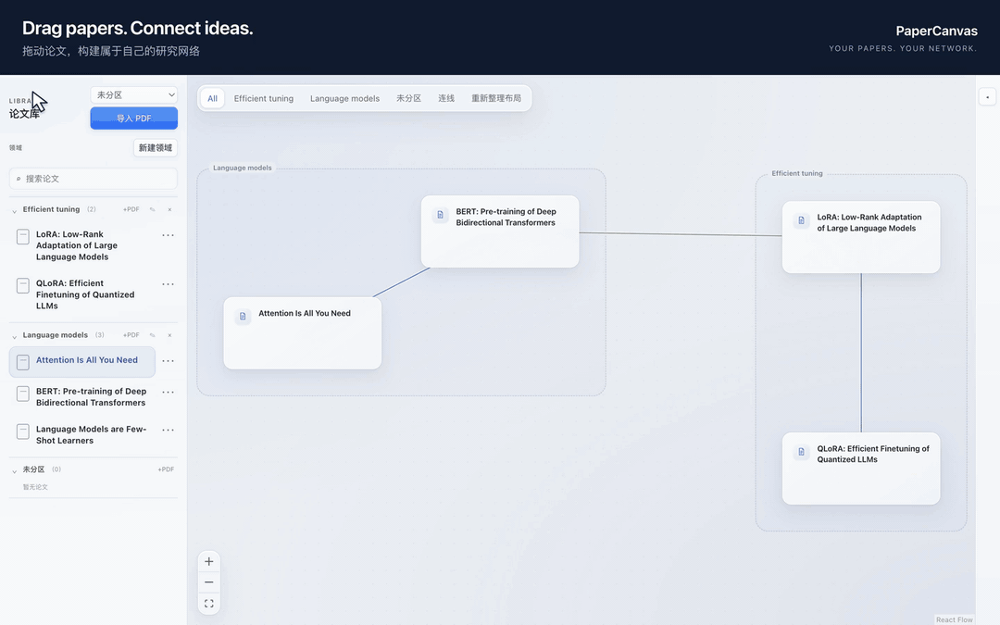

# PaperCanvas

[](LICENSE)
[](https://github.com/Skystellan/PaperCanvas/releases/latest)
[](https://github.com/Skystellan/PaperCanvas/releases/latest)

**Drag papers. Connect ideas. Build your own research network.**

**拖动论文，连接思路，构建属于自己的论文网络。**

PaperCanvas turns your paper library into a visual map of your thinking.
Bring papers onto an infinite canvas, connect their ideas, and shape the network
as your understanding grows.



[Watch the HD demo](docs/media/paper-network-demo.mp4) · [Static preview](docs/media/paper-network-poster.png)

- **Drop a paper.** Drag it from your library onto the canvas. 从论文库拖入画布。
- **Connect your ideas.** Link papers and record support, challenges, and evidence. 连起论文之间的关系。
- **Make the space yours.** Move cards while connections and topic regions follow smoothly. 拖动整理，让研究脉络逐渐清晰。

*Real app demo · sample papers and illustrative connections · 2× playback.*

Read, highlight, annotate, and discuss papers in the same local-first workspace.
PDFs and product data stay in app-owned local storage. The macOS and Windows desktops
use Chromium through Electron. The reader can open ChatGPT in an embedded browser;
annotations and Markdown-based Markmap mind maps work entirely offline.

**使用指南：** [下载安装](#download) · [快速上手](#快速上手) ·
[论文库与画布](#论文库与画布) · [账号密码登录](#chatgpt-账号密码登录) ·
[复制论文名与讨论](#复制论文名并开始讨论) · [阅读与批注](#阅读高亮与批注) ·
[笔记](#markdown-笔记) · [思维导图](#思维导图) · [快捷键](#快捷键速查)

## Download

Get the app from [GitHub Releases](https://github.com/Skystellan/PaperCanvas/releases/latest).

### Windows

**Windows 10/11, x64 (Intel or AMD).**

1. Download `PaperCanvas-0.2.5-Windows-x64.zip` from the release's **Assets**.
2. Extract the entire archive into a writable folder, then open `PaperCanvas.exe`
   inside `PaperCanvas-win32-x64`. Keep the adjacent resources and DLLs together.
3. Import PDFs using the file picker or drag them from File Explorer. PDF search
   uses **Ctrl+F**; Markdown formatting uses **Ctrl+B/I/K**.

No installer, administrator access, Node.js, Rust, or separate WebView2 install is
needed to run this build. Application data is stored separately at
`%APPDATA%\com.papercanvas.desktop` (including the `chromium` sign-in profile).
Quit the app before replacing the extracted folder to upgrade; your library and
notes stay in the data directory. This community build is unsigned, so Windows
may show an unknown-publisher/SmartScreen prompt on first launch.

### macOS

**Apple Silicon Macs (M1 or newer), macOS 13+.**

1. Download `PaperCanvas-0.2.5-macOS-arm64.zip` from the release's **Assets**.
2. Unzip it and move `PaperCanvas.app` to **Applications**. Quit an older copy before replacing it.
3. Open PaperCanvas and import your PDFs. Upgrading the app preserves your local library and notes.

This community build is ad-hoc signed, without an Apple Developer ID or notarization.
If macOS blocks the first launch and you trust this download, use **System Settings →
Privacy & Security → Open Anyway** after attempting to open it. See
[Apple's opening instructions](https://support.apple.com/en-us/102445).
Intel Mac, native Windows ARM64, and Linux binaries are not included in this release.

## 快速上手

1. 在左侧「论文库」点击 **导入 PDF**，也可以把 PDF 从 Finder / 文件资源管理器拖入论文库。
2. 将论文库中的论文拖到中间画布，建立一张论文卡片；双击论文库条目或画布卡片进入阅读器。
3. 阅读时使用右侧的 **Notes / Mind map / AI chat**，分别记录笔记、整理导图和打开 ChatGPT。
4. 第一次使用 **AI chat**，点击 **＋** 新建讨论，在内嵌网页中使用原 ChatGPT 账号的邮箱和 OpenAI 密码登录。
5. 点击聊天工具栏的 **⧉（复制论文信息）**，再点击 ChatGPT 输入框，用 **⌘V / Ctrl+V** 粘贴论文名，补上问题并发送。
6. 回到画布，按一次 **空格键**，依次点击两张论文卡片建立连线；按 **Esc** 退出连线模式。

PDF 阅读、批注、笔记和导图可以离线使用；ChatGPT 讨论需要网络和你自己的 ChatGPT 账号。
PaperCanvas 不会自动把正在阅读的 PDF、选中文字或问题发给 ChatGPT。

## 论文库与画布

### 导入、分类与打开论文

- **导入多篇 PDF：** 在「导入 PDF」前选择目标领域，再在文件选择器中选择一个或多个 PDF；也可以从文件管理器拖入。导入的是本地副本，原文件保留。
- **论文标题：** 当前导入标题取自 PDF 文件名，不会自动查询论文元数据。可在导入前把文件改为正式论文名，方便之后搜索与复制；若列表里只是编号，向 ChatGPT 提问时请自行补全标题。
- **领域分类：** 点击「新建领域」输入名称并保存。论文右侧 **⋯ → 移动到领域** 可以调整分类；未分类的论文在「未分区」中。
- **搜索与阅读：** 用「搜索论文」筛选列表。单击条目定位已有的画布卡片，双击条目直接阅读；阅读不要求先把论文拖入画布。
- **调整宽度：** 拖动论文库右侧分隔线；双击该分隔线恢复默认宽度。

### 用空格键给论文连线

1. 先从论文库拖入至少两篇论文，在画布空白处单击，使焦点离开搜索框、按钮或文本编辑区。
2. **按一次空格键**，看到「连线模式：请选择第一个节点」后，松开空格即可；也可以点击画布工具栏的 **连线**。
3. 单击第一张卡片，再单击第二张卡片，建立两篇论文之间的连线。
4. 连好一条后仍处于连线模式，可以继续选择下一对论文。再次按空格会清除当前起点、重新选择第一张卡片。
5. 按 **Esc** 或再次点击 **连线** 按钮退出。退出后才能恢复拖动卡片、双击打开论文。

空格是进入连线模式的快捷键，不需要一直按住，也不用按住空格拖动画布。在搜索框、笔记和其他文本输入区输入空格时，仍按普通文字输入处理。
连线模式下还可以用 **Tab** 把焦点移到卡片，再用 **Enter** 依次选择两个端点。

### 整理画布、解释关系与删除

- 拖动画布空白处可平移视图；滚轮 / 触控板滚动也用于平移，触控板捏合用于缩放。拖动卡片会带动相关节点和领域背景调整位置。
- 顶部 **All / 领域名 / 未分区** 用来切换显示范围；**重新整理布局** 会重新安排当前范围内的论文。
- 单击一条连线，选择 **Support（支持）/ Challenge（质疑）/ 未分类**。在「解释」中记录关系，在「证据」中填写摘录、来源或页码，点击 **保存解释与证据**。切换选择会保留草稿，进入阅读器前也会保存。
- 选中画布卡片后，按 **Delete / Backspace** 或点击 **从白板移除选中卡片**，只移除卡片及其连线；论文和 PDF 仍在论文库，可以再次拖入。
- 选中连线后，按 **Delete / Backspace** 或点击 **删除选中连线**，只删除关系。
- 论文库中的 **⋯ → 删除 → 确认删除** 会删除论文库记录、受管 PDF 副本及关联内容，原始导入文件不受影响；已有 `.md` 笔记文件会保留作安全副本。只想整理画布时，应使用「从白板移除」。

## ChatGPT 账号密码登录

PaperCanvas 的 **AI chat** 打开的是 ChatGPT 官网。这里使用的是你的 **ChatGPT / OpenAI 账号密码**，不需要另外注册 PaperCanvas 账号或填写 API Key。
应用内的登录状态独立保存；系统浏览器已经登录，不代表应用内也登录了。

### 已有 OpenAI 密码

1. 双击打开一篇论文，选择右侧 **AI chat**；没有讨论时，点击顶部 **＋**。
2. 在内嵌 ChatGPT 页面点击 **Log in / 登录**，输入原账号的完整邮箱，选择密码登录并输入 **OpenAI 密码**。
3. 按页面要求完成邮箱验证或多因素认证。登录后仍可能要求验证码，这本身不代表在注册新账号。
4. 核对 ChatGPT 中的账号、订阅和历史对话，确认与平时使用的账号一致。

登录会话保存在本机的应用数据目录中，通常重新打开应用无需再次登录；会话过期或账号安全策略变化时，需要重新验证。
忘记已设置的 OpenAI 密码，可以在官网登录页面选择 **Forgot password? / 忘记密码**，按邮件完成重置。
密码设置和重置影响同一个 OpenAI 账号。参见 [OpenAI 官方密码说明](https://help.openai.com/en/articles/4936828-resetting-or-changing-your-chatgpt-password)。

### 原来一直用 Google 登录，没有 OpenAI 密码

**Google 密码和 OpenAI 密码是两回事。** 先在已有账号内添加 OpenAI 密码，再尝试应用内的账号密码登录：

1. 在正常使用的系统浏览器打开 [ChatGPT](https://chatgpt.com/)，用 **Continue with Google / 使用 Google 账户继续** 登录原来的 Google 账号。
2. 检查原有 Plus/Pro 订阅和历史对话，在 **Settings → Account / 设置 → 账号** 中确认完整邮箱。
3. 如果该账号提供 **Add password / 添加密码**，在这里完成设置。已经有密码则直接使用；这一步不需要创建新账号，也不需要更改邮箱。
4. 回到 PaperCanvas，在内嵌网页选择 **登录**，使用上一步核对的邮箱和新设的 **OpenAI 密码**，再完成要求的验证。
5. 再次确认订阅和历史对话。若显示错误账号，先在内嵌 ChatGPT 中退出，再按正确账号重试。

社交登录账号添加密码的步骤见 [OpenAI 官方账号说明](https://help.openai.com/en/articles/4936827-how-to-change-your-email-address)。
如果没有「添加密码」入口，或仍提示 **Wrong authentication method**，请继续在系统浏览器用原登录方式访问，或联系 OpenAI 支持；不要把 Google 密码当作 OpenAI 密码，也不要重新注册来尝试“关联”订阅。
未设置 OpenAI 密码的 Google 登录账号，直接使用「忘记密码」并不能代替在原账号内添加密码。

### 登录问题排查

| 现象 | 处理方式 |
| --- | --- |
| 浏览器一打开就已经在聊天页，但应用内仍未登录 | 两边的会话独立。在应用内完成账号密码登录；「在浏览器中打开」只打开网页。 |
| 点击内嵌网页的 Google 登录后出现提示 | 使用上面的账号密码流程；「登录帮助」中也有原 Google 账号添加密码的说明。 |
| 邮箱输入后只看到验证码，或出现姓名、生日等注册资料表单 | 核对是否进入「登录」以及账号邮箱是否正确；仅输入 Gmail 地址不等于完成了 Google 授权。若界面提供密码登录选项，使用已设置的 OpenAI 密码；出现注册流程时先返回核对。 |
| Plus/Pro 和历史对话不见了 | 先检查完整邮箱、登录方式和当前工作区；这不能单独证明新建了账号。不要急于重新订阅，先对照正常浏览器中的原账号。 |
| 空白、加载缓慢或网站验证未完成 | 在聊天的 **⋯** 菜单中选择 **重新加载网页**，或在浏览器中继续。重新加载保留应用内的登录数据。 |

仍无法登录时，参见 [OpenAI 官方登录排查](https://help.openai.com/en/articles/7426629-why-cant-i-log-in-to-chatgpt)。
PaperCanvas 不合并 ChatGPT 账号，不同步外部浏览器 Cookie；「关联已有对话」也只保存链接。

## 复制论文名并开始讨论

### 从当前论文发起讨论

1. 打开论文，切换到 **AI chat**，完成上面的账号密码登录。
2. 点击工具栏的 **＋（新对话）**，为这篇论文建立一条讨论记录。
3. 点击 **⧉（复制论文信息）**。它只把**当前论文标题**放入剪贴板，成功时没有额外弹窗；不会复制 PDF、摘要、作者或全文。
4. 点击 ChatGPT 的消息输入框，按 **⌘V（macOS）/ Ctrl+V（Windows）**，或使用输入框的粘贴菜单。
5. 检查粘贴的论文名，补充你的问题，手动发送。例如：

   > 我正在阅读《在这里粘贴论文名》。请先确认你能获得的论文信息，帮我梳理研究问题、方法和主要结论；不确定的内容请说明。

**只粘贴标题并不等于 ChatGPT 已经拿到 PDF。** 要分析特定公式、图表或原文，请自行复制相关段落、粘贴截图，或通过 ChatGPT 页面提供的附件入口上传 PDF；能否上传及大小限制由 ChatGPT 决定。
PaperCanvas 不会替你发送这些内容，也不会自动点击发送按钮。

第一条消息产生正式对话后，应用自动保存该对话链接，并按 ChatGPT 网页标题更新讨论名称。
同一篇论文可以有多条讨论：用顶部下拉框切换，用 PaperCanvas 的 **＋** 为新主题创建独立记录。

### 继续已有讨论

1. 如果讨论在浏览器中已有，复制地址栏里的原始对话地址，例如 `https://chatgpt.com/c/…`，不要使用 `/share/…` 分享链接。
2. 在 PaperCanvas 的聊天工具栏点击 **⋯ → 关联已有对话**。
3. 填写「讨论名称」和「ChatGPT 对话链接」，点击 **保存并打开**。应用内登录的账号必须有权访问该对话。

| 聊天工具栏操作 | 用途 |
| --- | --- |
| 顶部下拉框 | 切换当前论文的不同讨论。 |
| **＋** | 新建独立讨论。仅在 ChatGPT 网页内换话题，不会替换已绑定的链接。 |
| **⧉** | 复制当前论文标题，随后需要手动粘贴。 |
| **⋯ → 重命名** | 修改当前讨论的本地名称；之后网页标题变化仍可能同步更新它。 |
| **⋯ → 回到绑定对话** | 网页中走到其他页面后，返回这条记录保存的原对话。 |
| **⋯ → 在浏览器中打开** | 用系统浏览器打开已绑定对话；尚未绑定时打开 ChatGPT 首页。 |
| **⋯ → 登录帮助 / 重新加载网页** | 查看密码登录指引，或重试加载网页。 |

再次打开论文时会恢复上次打开的讨论；首页 **Recent discussions** 可以直接打开相应论文中的指定讨论。
本地保存的是讨论名称与链接，消息内容仍在 ChatGPT 中，无法离线查看。ChatGPT Projects 是可选项，PaperCanvas 自己按论文管理讨论链接。

## 阅读、高亮与批注

- **翻页与缩放：** 在 PDF 区连续滚动，或用顶部 **← / →** 翻页；用 **− / ＋**、触控板捏合或 **⌘ / Ctrl + 滚轮** 调整缩放。再次打开论文会恢复阅读位置和缩放。
- **搜索全文：** 点击放大镜，或在 PDF 阅读区按 **⌘F / Ctrl+F**。输入关键词后，用 **Enter / Shift+Enter** 查找下一个 / 上一个结果，按 **Esc** 关闭搜索。搜索覆盖尚未显示的页面；扫描件需要已有文字层，当前没有 OCR。
- **章节与书签：** PDF 右侧的短线是目录入口，悬停或聚焦后显示标题，也可以点击目录按钮固定展开。点击章节跳转；**收藏本页** 添加书签，再点一次移除。没有内置目录时仍可使用页码导航。
- **保存批注：** 拖选 PDF 文字，弹出 **Annotation** 面板后可填写评论，点击 **Save annotation**。评论可留空，只保存高亮；在批注输入框中也可按 **⌘Enter / Ctrl+Enter** 保存，按 **Esc** 关闭面板。
- **回看高亮：** 在 **Notes** 页签展开 **Highlights**，点击条目回到原文位置；搜索按钮可按摘录、评论或页码筛选。每条高亮也有删除按钮。
- **摘录到笔记：** 在选中文字的面板或已有高亮条目中点击 **Add to notes**，将摘录与来源链接加入当前论文笔记；点击笔记中的来源链接可回到 PDF 对应位置。
- **侧栏布局：** 拖动 PDF 与右侧栏之间的分隔线调整宽度，用顶部 **Hide panel / Show panel** 收起或展开侧栏。

## Markdown 笔记

1. 打开论文的 **Notes** 页签，直接输入笔记。内容自动保存，切换论文、返回画布或退出时会等待待保存内容完成。
2. 默认 **Live preview**：单击某个段落可编辑其 Markdown 源码，移开光标后恢复排版。一整段列表、表格或代码块会一起进入编辑状态。
3. 选中文字后，用工具栏或 **⌘B / Ctrl+B** 加粗、**⌘I / Ctrl+I** 斜体、**⌘K / Ctrl+K** 插入链接；在列表末尾按 **Enter** 继续列表。
4. 通过笔记的 **View** 菜单切换 **Live preview / Source / Read**；可渲染标题、引用、代码块、表格和任务列表。
5. 在笔记操作菜单 **More → Show .md** 中定位绑定的 Markdown 文件；可使用外部编辑器，或把文件所在的 `papers` 目录作为 Obsidian 库打开。

每篇论文绑定一个 `papers/<paper-id>.md` 文件，紧邻受管 PDF；绑定依赖论文 ID，标题变化不会改变绑定。
旧版本数据库中的笔记会在首次打开时迁移到该文件，原数据库记录保留作备份。

外部编辑后，使用 **More → Reload** 读取最新文件；这可能放弃当前未保存草稿，按确认提示操作。
如果保存时提示文件已被外部修改，先复制当前草稿，再 Reload 后合并，避免同时在两个编辑器里写入。
应用在保存前检查外部改动，不会持续监视文件；不包含 Obsidian 插件、双链语法或数学公式渲染。

## 思维导图

1. 在 **AI chat** 中请 ChatGPT 输出 Markdown 大纲，或自己编写。可使用提示：

   > 请把我们讨论的论文整理为 Markdown 大纲：一级标题为论文名，二级标题包含研究问题、方法、实验、结论与局限；细节使用列表，不要输出 Mermaid。

2. 复制大纲，切换到当前论文的 **Mind map** 页签，粘贴到 **Markdown source**。
3. 点击 **Render preview** 渲染。成功后编辑区收起，用 **Edit source** 再次展开；修改源码后需要再次渲染，预览才会更新。
4. 点击节点圆点折叠分支，拖动导图平移，用 **− / ＋** 缩放、**Fit** 适配视图。
5. 点击 **Save source** 主动保存源码；离开或关闭时也会保存未完成草稿。源码和导图均留在本机。

可直接试用下面的格式：

```markdown
# 论文名称
## 研究问题
- 要解决的问题
- 已有方法的不足
## 方法
- 核心思路
- 关键假设
## 实验与结论
- 主要证据
- 局限与后续问题
```

带有 `markdown`、`md` 或 `markmap` 标记的代码围栏也能粘贴；当前使用 **Markmap** 渲染 Markdown，不会自动向 AI 请求生成导图。
旧版树结构会转为 Markdown；已有 Mermaid 文本会保留供复制、修改，需要改写成 Markdown 大纲再渲染。
导图渲染不需要 AI 账号，也不从粘贴内容中加载外部脚本、图片或字体。

## 快捷键速查

`⌘` 表示 macOS 的 Command 键，`Ctrl` 用于 Windows。快捷键取决于当前焦点所在区域。

| 场景 | macOS | Windows | 效果 |
| --- | --- | --- | --- |
| 画布，焦点不在输入框或按钮上 | 空格 | 空格 | 进入连线模式，随后依次点两张卡片；再次按下会重选起点。 |
| 画布连线模式 | Esc | Esc | 退出连线模式，恢复拖动和双击阅读。 |
| 连线模式中的卡片 | Tab、Enter | Tab、Enter | Tab 移动焦点，Enter 选择端点。 |
| 选中的画布卡片 / 连线 | Delete / Backspace | Delete / Backspace | 从画布移除卡片或删除连线，保留论文库里的论文。 |
| PDF 阅读区 | ⌘F | Ctrl+F | 打开 PDF 全文搜索。 |
| PDF 搜索框 | Enter / Shift+Enter | Enter / Shift+Enter | 下一个 / 上一个匹配。 |
| PDF 搜索框、批注面板 | Esc | Esc | 关闭当前搜索或批注面板。 |
| PDF 上的滚轮操作 | ⌘ + 滚轮 | Ctrl + 滚轮 | 缩放 PDF；也可以直接使用触控板捏合。 |
| 批注输入框 | ⌘Enter | Ctrl+Enter | 保存高亮与可选评论。 |
| Markdown 笔记编辑区 | ⌘B / ⌘I / ⌘K | Ctrl+B / Ctrl+I / Ctrl+K | 加粗 / 斜体 / 插入链接。 |
| ChatGPT 输入框 | ⌘V | Ctrl+V | 粘贴刚刚通过 ⧉ 复制的论文标题或其他剪贴板内容。 |
| 已聚焦的论文库宽度分隔线 | ← / →、Home / End | ← / →、Home / End | 调整宽度，或设为最小 / 最大宽度。 |

如果按空格没有进入连线模式，先退出输入框，在画布空白处单击再试；如果卡片突然不能拖动，检查是否仍在连线模式，按 Esc 退出。
在 ChatGPT 网页内，其他编辑与发送快捷键由 ChatGPT 自己处理。

## What is included

- Resizable Paper Library with search, multi-PDF import, file-manager drag-and-drop,
  domains, and compact per-paper action menus
- Double-click a library paper to read it; single-click to locate its canvas card
- Infinite whiteboard with domain views, force layout, and explicit connections
- Remove canvas cards without deleting their library papers; remove connections
  with selection actions or Delete/Backspace
- Support/challenge relationships with locally saved explanations and evidence
- PDF.js reader with selectable text, continuous scrolling, trackpad pinch zoom,
  and restoration of each paper's reading position and reader layout
- PDF text search with Cmd/Ctrl+F, highlighted results and previous/next matches;
  a compact right-side table of contents and locally saved page bookmarks
- Persistent highlights and comments, with coherent backgrounds for overlapping
  formula symbols, plus source-linked quotations in Markdown notes
- Autosaving Markdown notes with live preview, optional source/reading views,
  formatting shortcuts, and one `.md` file bound to each paper
- Paste a Markdown outline from a conversation or write it manually, then render and
  save a local mind map; no AI SDK, runtime, or account is required for this
- Resizable embedded ChatGPT discussion rail with named conversations per paper,
  existing conversation links, and restoration of the last-opened discussion
- Recent discussions remains expanded by default
- Coordinated navigation/close saving and additive SQLite migrations

Canvas dragging uses a continuous force layout within each domain. Connected
hubs have more inertia, so moving a leaf has less effect on the whole network.
When dragging a hub, its less-connected immediate neighbors gently retain their
original directions around it. This preserves a star's structure while allowing
connection lengths to change for spacing and collision avoidance.
Dragging starts from the existing connection lengths instead of compacting the
network again. A released card keeps its drop point while its neighbors settle;
the next drag or explicit re-layout can move it again. Region
backgrounds follow their member cards, expanding and shrinking as cards move.
When a region grows into a neighbor, that neighboring group smoothly moves aside
as a whole, preserving its internal arrangement and domain membership.
Cross-domain links remain visible without pulling regions together. Connections
may cross, and the layout settles before its positions are saved. Existing
intersecting regions are separated on load, while valid saved positions are kept.
Connections remain straight. After the network slows down, gentle repulsion
gradually separates nearby or crossing connections and opens space around cards.
Springs preserve reasonable spacing and can stretch for readability. Excessively
long connections retain a gentle restoring force while the layout cools, so
repeated dragging does not keep accepting longer and longer natural lengths.
Movement stays bounded per frame. Dense graphs can retain
crossings. All connections remain fully visible while selecting or dragging cards.

## Local data and embedded conversations

- `papercanvas.db` stays in the existing `com.papercanvas.desktop` application
  data directory, shared with the earlier Tauri build.
- Imported PDFs are copied into app-owned `papers/<uuid>.pdf` storage. Original
  Finder paths are not persisted.
- Papers, layouts, connections, annotations, notes, and mind-map sources are local.
  Saving or rendering them does not contact an AI service.
- Embedded ChatGPT conversation names and links are stored locally; message
  content remains in ChatGPT. Opening a linked discussion loads that website.
- No PDF, selection, or question is sent automatically. Copy paper information
  copies only the paper title; the user chooses what to paste or attach in ChatGPT.
- The former Codex SDK, runtime bridge, selection Translate/Ask AI, and automatic
  mind-map generation have been removed. Historical migrations and legacy stored
  data remain intact so existing libraries can upgrade without data loss.

## Development prerequisites

- Node.js 22.12 or newer and npm
- Stable Rust and the Tauri 2 prerequisites for development builds
- macOS 13+ with Xcode Command Line Tools, or Windows 10/11 x64 with
  Visual Studio 2022 Build Tools (Desktop development with C++) and the Windows SDK

A Codex installation or SDK login is not required. Embedded ChatGPT uses its own
website sign-in only when the user opens a discussion.

## Run locally

```sh
git clone https://github.com/Skystellan/PaperCanvas.git
cd PaperCanvas
npm ci
npm run chromium:dev
```

## Contributing

Bug reports and focused pull requests are welcome. See [CONTRIBUTING.md](CONTRIBUTING.md)
for development setup, the project structure, and checks to run before submitting changes.

## License

PaperCanvas is licensed under the [MIT License](LICENSE).
Third-party dependencies retain their respective licenses.

## Quality checks

```sh
npm run lint
npm run typecheck
npm run test:coverage
npm run build
cargo fmt --manifest-path src-tauri/Cargo.toml --check
cargo clippy --manifest-path src-tauri/Cargo.toml --all-targets --locked -- -D warnings
cargo test --manifest-path src-tauri/Cargo.toml --all-targets --locked
```

Create a desktop bundle for the current platform with:

```sh
npm run chromium:build
```

The bundle is generated under
`release/PaperCanvas-darwin-arm64/PaperCanvas.app` on Apple
Silicon, or `release/PaperCanvas-win32-x64/` on Windows x64. Windows builds
include `paper-canvas-backend.exe` and an ICO application icon. Quit the running copy before installing it in a fixed location such as
`~/Applications/PaperCanvas.app`. Moving the application does not move its
paper database or persistent ChatGPT profile. Packaging uses the optimized Rust
release backend. The published community build is ad-hoc signed; Developer ID
signing and notarization are needed for a verified publisher and smoother first launch.

The **Desktop builds** GitHub Actions workflow runs on macOS and Windows,
checks the frontend and Rust backend, runs a native Electron smoke test, and
uploads versioned ZIP artifacts. It can also be started manually. Download both
platform artifacts and attach them to a GitHub Release with the matching version
tag and `docs/releases/<tag>.md` notes after the workflow succeeds.

## Releases and update notifications

Packaged Electron builds check the public
[latest GitHub release](https://github.com/Skystellan/PaperCanvas/releases/latest)
once after startup. A newer stable version prompts **View release** or **Later**;
**Help → Check for Updates…** also reports when the app is up to date or a check
fails. Checks time out after 10 seconds, with no automatic retries. Startup
failures stay quiet, and development and smoke runs do not check automatically.
The request uploads no app data, installed version, or login credentials. The
app only opens the fixed GitHub release page; it never downloads or installs an
update itself. Choosing **Later** dismisses the prompt until the next launch or
manual check. An app left running does not poll for new releases.

To notify installed copies, publish a public, non-draft, non-prerelease GitHub
Release in `Skystellan/PaperCanvas` and mark it **Latest**. Use a stable semantic
version tag such as `v1.2.3` (or `1.2.3`) matching the packaged app version, and
increase its numeric major/minor/patch version for each update. Build metadata
does not affect comparison; prerelease tags are not supported. Upload the
installable app assets and include release notes and installation instructions
before publishing. A commit, pushed tag, or uploaded file alone is insufficient;
the checker uses GitHub's
[latest release API](https://docs.github.com/en/rest/releases/releases#get-the-latest-release).

Older versions without this checker cannot receive retroactive alerts. Their
users must manually install a build containing it before future releases can
trigger in-app notifications. The legacy Tauri build has no such checker.

## Chromium desktop and embedded login

The current desktop uses Electron's `WebContentsView` for embedded ChatGPT and retains the existing
Rust storage and Markdown notes:

```sh
npm run chromium:dev
npm run chromium:build
```

It uses the existing `com.papercanvas.desktop` data directory. ChatGPT uses its
own persistent Chromium profile under that directory's `chromium` subdirectory;
Chrome's cookies are not imported or synchronized. The original Tauri/WKWebView
build remains available through `npm run tauri -- dev`; quit the other version
before comparing them.

For the supported email/password workflow, including existing Google accounts, see
[ChatGPT 账号密码登录](#chatgpt-账号密码登录). External-browser sign-in is separate
from the embedded session; the app does not import browser cookies.

If the embedded page stays blank, **重新加载网页** reloads the current page
(ignoring HTTP cache in Chromium) while keeping its login/session storage.
Chromium now displays website-verification, network-failure and slow-load
notices. Reopening a cached view restores its load status instead of reporting
an unqualified “opening” message. Website verification titles such as
“请稍候…” do not overwrite conversation names.

In either version, **在浏览器中打开** opens the selected discussion in the default
browser, using that browser's existing session. This is the smallest workaround
when WKWebView is slow. Switching engines can help rendering compatibility; it
does not guarantee faster ChatGPT network responses.

PDF pinch and repeated zoom buttons preview the existing page layer with a CSS
transform. PDF.js applies the final scale after input settles, preserving the
page point under the pointer, then redraws at full resolution.

`npm run chromium:test` checks desktop boundaries.
`npm run chromium:smoke` runs a real Chromium window with a synthetic 20-page
PDF and local chat fixture in a temporary profile. It checks zoom, selectable
text, retained chat drafts, and remote page isolation without accessing real
ChatGPT conversations or the user's library.

`PAPERCANVAS_PERFORMANCE=1 node electron/run-smoke.mjs` measures frame times and
Chromium layout/style/script work on a synthetic 150-page PDF. Set
`PAPERCANVAS_SMOKE_PDF=/absolute/path/to/paper.pdf` to import a local copy into the
temporary profile instead. This mode also checks the zoom anchor and text
selection after settling. Build first with `npm run build`.
