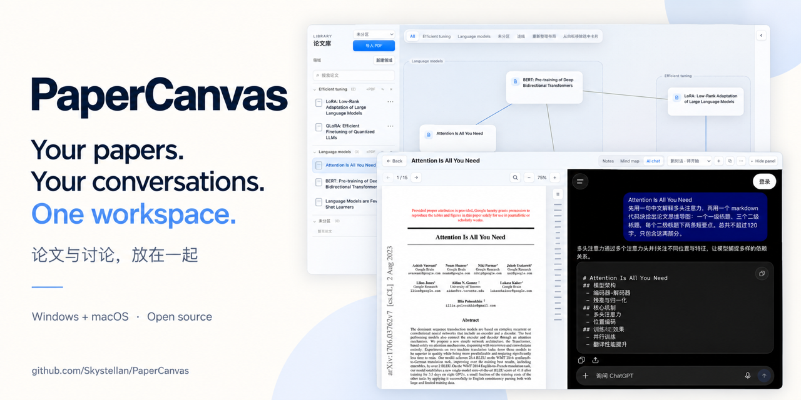

# PaperCanvas



**[English](README.md)** | [简体中文](README.zh-CN.md)

[](LICENSE)

[](https://github.com/Skystellan/PaperCanvas/releases/download/v0.2.7/PaperCanvas-0.2.7-Windows-x64-Setup.exe)
[](https://github.com/Skystellan/PaperCanvas/releases/download/v0.2.7/PaperCanvas-0.2.7-macOS-arm64.zip)

Download directly with the buttons above: **Windows 10/11 x64 installer** or **macOS 13+ Apple Silicon ZIP**.
[Installation guide](#download) · [All downloads and release notes](https://github.com/Skystellan/PaperCanvas/releases/latest)

**A dozen ChatGPT tabs open for your papers? I built an open-source app that keeps papers and discussions together.**

PaperCanvas turns your paper library into a visual map of your thinking.
Bring papers onto an infinite canvas, connect their ideas, and shape the network
as your understanding grows.

**Keep paper discussions with the papers they belong to.** Read a PDF and ask ChatGPT
beside it, without keeping a separate browser chat window or tab open for every paper.
PaperCanvas manages multiple named discussions per paper, lets you switch between them,
and restores the last discussion when you reopen the paper.


[Watch the HD demo](docs/media/paper-network-demo.mp4) · [Static preview](docs/media/paper-network-poster.png) · [Share cover](docs/media/papercanvas-social-preview.png)

- **Drop a paper.** Drag it from your library onto the canvas.
- **Connect your ideas.** Link papers and record support, challenges, and evidence.
- **Make the space yours.** Move cards while connections and topic regions follow smoothly.

*Recorded in the real app with public research PDFs and the actual embedded ChatGPT website, at 2× speed. The mind map uses Markdown copied from the live reply. The paper connections are illustrative; no personal library or signed-in account is recorded.*

Read, highlight, annotate, and discuss papers in the same local-first workspace.
PDFs and product data stay in app-owned local storage. The macOS and Windows desktops
use Chromium through Electron. The reader can open ChatGPT in an embedded browser;
annotations and Markdown-based Markmap mind maps work entirely offline.

**User guide:** [Download](#download) · [Quick start](#quick-start) ·
[Library and canvas](#paper-library-and-canvas) · [Account sign-in](#chatgpt-email-and-password-sign-in) ·
[Copy titles and discuss](#copy-a-paper-title-and-start-a-discussion) · [Reading and annotations](#reading-highlights-and-annotations) ·
[Notes](#markdown-notes) · [Mind maps](#mind-maps) · [Keyboard shortcuts](#keyboard-shortcuts)

**Project:** [Features](#what-is-included) · [Local data and privacy](#local-data-and-embedded-conversations) ·
[Development](#development-prerequisites) · [Contributing](#contributing) · [Discussions](https://github.com/Skystellan/PaperCanvas/discussions) · [Updates](#releases-and-update-notifications) · [License](#license)

## Download

The current release is **0.2.7**. Choose your platform below to download directly; there is no need to sort through release assets.

| Your computer | Download | After downloading |
| --- | --- | --- |
| Windows 10/11, Intel or AMD x64 | **[Download Windows installer (.exe)](https://github.com/Skystellan/PaperCanvas/releases/download/v0.2.7/PaperCanvas-0.2.7-Windows-x64-Setup.exe)** | Double-click to install; supports future in-app updates. |
| macOS 13+, Apple Silicon (M1 or newer) | **[Download for Mac (.zip)](https://github.com/Skystellan/PaperCanvas/releases/download/v0.2.7/PaperCanvas-0.2.7-macOS-arm64.zip)** | Unzip, then move PaperCanvas.app to Applications. |

[Release notes and other files](https://github.com/Skystellan/PaperCanvas/releases/latest). You do not need the source archives or updater metadata to install the app.

### Windows

**Windows 10/11, x64 (Intel or AMD).**

1. Click **[Download Windows installer](https://github.com/Skystellan/PaperCanvas/releases/download/v0.2.7/PaperCanvas-0.2.7-Windows-x64-Setup.exe)**. This is the recommended build for application-managed updates.
2. Quit an older PaperCanvas copy, run the installer, and open PaperCanvas from its shortcut. It installs for the current user and reuses the existing local data directory.
3. Import PDFs using the file picker or drag them from File Explorer. PDF search uses **Ctrl+F**; Markdown formatting uses **Ctrl+B/I/K**.
4. For future updates, use **Help → Check for Updates…**. A newer version downloads in the background, with progress on the taskbar; choose **Restart and install** when it is ready. PaperCanvas saves before restarting.

**Portable alternative:** download the [Windows portable ZIP](https://github.com/Skystellan/PaperCanvas/releases/download/v0.2.7/PaperCanvas-0.2.7-Windows-x64.zip), extract the entire archive into a writable folder, and open `PaperCanvas.exe` inside `PaperCanvas-win32-x64`. Keep the adjacent resources and DLLs together. This ZIP build still uses manual upgrades: quit the app and replace the program folder, or install the Setup version once to enable future in-app installation.

No Node.js, Rust, or separate WebView2 install is needed. Data is stored separately at `%APPDATA%\com.papercanvas.desktop`, including the `chromium` sign-in profile. The installer and portable app use the same data directory under the same Windows user account; keep only the copy you intend to use. This community build is unsigned, so Windows may show an unknown-publisher/SmartScreen prompt on first launch.

### macOS

**Apple Silicon Macs (M1 or newer), macOS 13+.**

1. Click **[Download for Mac](https://github.com/Skystellan/PaperCanvas/releases/download/v0.2.7/PaperCanvas-0.2.7-macOS-arm64.zip)**.
2. Unzip it and move `PaperCanvas.app` to **Applications**. Quit an older copy before replacing it.
3. Open PaperCanvas and import your PDFs. Upgrading the app preserves your local library and notes.

This community build is ad-hoc signed, without an Apple Developer ID or notarization.
If macOS blocks the first launch and you trust this download, use **System Settings →
Privacy & Security → Open Anyway** after attempting to open it. See
[Apple's opening instructions](https://support.apple.com/en-us/102445).
Intel Mac, native Windows ARM64, and Linux binaries are not included in this release.

### Manual upgrades and data backups

Replacing the program does not delete your library. Application files and personal data are stored separately:

| Platform | Local data directory |
| --- | --- |
| Windows | `%APPDATA%\com.papercanvas.desktop` |
| macOS | `~/Library/Application Support/com.papercanvas.desktop` |

The directory contains the database, imported PDFs, Markdown notes, and the `chromium` profile for embedded sign-in. ChatGPT conversation content remains on ChatGPT; PaperCanvas stores the conversation links. Keeping the profile does not guarantee that ChatGPT will never request sign-in again.

1. Quit PaperCanvas normally and let it finish saving. If saving fails, resolve the error before upgrading.
2. For a backup, copy the **entire data directory** to a safe location while the app is closed. Do not back up only the executable or database.
3. Replace the program or run the new installer, then launch the new version using the same operating-system user account. Do not delete the data directory or choose an uninstall option that removes personal data.
4. Open a familiar paper and check its notes. You can remove the old program copy once the new version works; keep your backup separately.

To find the data directory, paste the Windows path into File Explorer's address bar, or use **Finder → Go → Go to Folder…** on Mac. These are upgrade instructions; installing an older version over a newer database is not a supported rollback procedure.

## Quick start

1. Click **导入 PDF (Import PDF)** in the left-hand **论文库 (Paper Library)**, or drag PDFs into the library from Finder or File Explorer.
2. Drag a paper from the library onto the central canvas to create a card. Double-click a library entry or canvas card to open the reader.
3. Use **Notes / Mind map / AI chat** on the right to take notes, organize a mind map, or open ChatGPT.
4. The first time you use **AI chat**, click **＋** to create a discussion, then sign in on the embedded website with your existing ChatGPT account's email and OpenAI password.
5. Click **⧉ (复制论文信息 / Copy paper information)** in the chat toolbar, click the ChatGPT message box, and press **⌘V / Ctrl+V** to paste the paper title. Add your question and send it yourself.
6. Return to the canvas, press **Space once**, and click two paper cards in sequence to connect them. Press **Esc** to exit connection mode.

PDF reading, annotations, notes, and mind maps work offline. ChatGPT discussions require an internet connection and your own ChatGPT account.
PaperCanvas does not automatically send the open PDF, selected text, or questions to ChatGPT.

## Paper library and canvas

### Import, organize, and open papers

- **Import multiple PDFs:** Select a destination domain before clicking **导入 PDF (Import PDF)**, then select one or more PDFs in the file picker. You can also drag files in from your file manager. Importing creates a local copy and leaves the original file intact.
- **Paper titles:** Imported titles currently come from PDF filenames; the app does not look up paper metadata. Rename files to their full paper titles before importing to make searching and copying easier. If an entry only shows an identifier, provide the full title yourself when asking ChatGPT about it.
- **Domains:** Click **新建领域 (New domain)**, enter a name, and save. Use a paper's **⋯ → 移动到领域 (Move to domain)** menu to change its category. Uncategorized papers appear under **未分区 (Unassigned)**.
- **Search and read:** Filter the list with **搜索论文 (Search papers)**. Single-click an entry to locate its existing canvas card; double-click to read it directly. You do not need to add a paper to the canvas before reading it.
- **Library width:** Drag the divider at the library's right edge, or double-click it to restore the default width.

### Connect papers with Space

1. Drag at least two papers from the library onto the canvas. Click an empty area of the canvas to move focus away from search fields, buttons, or text editors.
2. **Press Space once.** When **连线模式：请选择第一个节点 (Connection mode: select the first node)** appears, release the key. You can also click **连线 (Connect)** in the canvas toolbar.
3. Click the first card, then the second card, to connect the papers.
4. Connection mode stays active after each connection, so you can keep selecting pairs of papers. Pressing Space again clears the current starting point and lets you select the first card again.
5. Press **Esc**, or click **连线 (Connect)** again, to exit. You can then drag cards and double-click them to read papers again.

Space enters connection mode; you do not need to hold it down, and you do not hold Space to pan the canvas. In search fields, notes, and other text inputs, Space still inserts a normal space.
In connection mode, you can also use **Tab** to focus cards and **Enter** to select each endpoint.

### Arrange the canvas, describe relationships, and delete items

- Drag an empty part of the canvas to pan. Mouse-wheel or trackpad scrolling also pans; a trackpad pinch zooms from 5% to 200%, so you can zoom out to see a much larger network. Moving a card adjusts related nodes and domain backgrounds.
- Use **All / a domain name / 未分区 (Unassigned)** at the top to choose what is visible. **重新整理布局 (Rearrange layout)** arranges the papers in the current view again.
- Click a connection and choose **Support / Challenge / 未分类 (Unclassified)**. Describe the relationship under **解释 (Explanation)** and add quotations, sources, or page numbers under **证据 (Evidence)**, then click **保存解释与证据 (Save explanation and evidence)**. Drafts are preserved when you change the selection and saved before you enter the reader.
- Select a canvas card and press **Delete / Backspace**, or click **从白板移除选中卡片 (Remove selected card from whiteboard)**. This removes only the card and its connections. The paper and PDF remain in the library, ready to be dragged onto the canvas again.
- Select a connection and press **Delete / Backspace**, or click **删除选中连线 (Delete selected connection)**, to remove only that relationship.
- In the library, **⋯ → 删除 → 确认删除 (Delete → Confirm deletion)** deletes the library record, managed PDF copy, and associated content. It leaves the original imported file intact and keeps existing `.md` notes as a safety copy. To tidy the canvas without deleting a paper, use the remove-from-whiteboard action.

## ChatGPT email and password sign-in

**AI chat** opens the official ChatGPT website. Use your **ChatGPT / OpenAI account email and password**; you do not need a separate PaperCanvas account or an API key.
The app saves its own sign-in session. Being signed in to your system browser does not sign you in to the app.

### If you already have an OpenAI password

1. Double-click a paper, select **AI chat** on the right, and click **＋** at the top if there is no discussion yet.
2. Click **Log in** on the embedded ChatGPT page. Enter your existing account's full email address, choose password sign-in, and enter your **OpenAI password**.
3. Complete any email verification or multifactor authentication requested by the website. A verification-code prompt can appear during sign-in; it does not by itself mean you are creating a new account.
4. Check your account, subscription, and conversation history in ChatGPT to confirm that you are using your usual account.

The session is stored in the app's local data directory, so reopening the app usually does not require signing in again. An expired session or changes to account security policies may require verification again.
If you forget an OpenAI password you previously set, choose **Forgot password?** on the official sign-in page and follow the reset email.
Setting or resetting the password affects that same OpenAI account. See [OpenAI's password instructions](https://help.openai.com/en/articles/4936828-resetting-or-changing-your-chatgpt-password).

### If you have always signed in with Google and have no OpenAI password

**Your Google password and your OpenAI password are separate.** Add an OpenAI password within your existing account before trying email and password sign-in in the app:

1. Open [ChatGPT](https://chatgpt.com/) in your usual system browser and use **Continue with Google** to sign in with your original Google account.
2. Check your existing Plus/Pro subscription and conversation history. Confirm the full email address under **Settings → Account**.
3. **If your account offers Add password**, set a password there. If it already has a password, use that password. You do not need to create a new account or change your email address.
4. Return to PaperCanvas, choose **Log in** on the embedded website, and use the email address you just checked and your newly set **OpenAI password**. Complete any requested verification.
5. Check your subscription and history again. If the wrong account appears, sign out within the embedded ChatGPT page and retry with the correct account.

See [OpenAI's account instructions](https://help.openai.com/en/articles/4936827-how-to-change-your-email-address) for adding a password to an account that uses social sign-in.
If **Add password** is unavailable, or you still see **Wrong authentication method**, continue using your original sign-in method in the system browser or contact OpenAI support. Do not enter your Google password as an OpenAI password or register another account to try to “link” your subscription.
For a Google sign-in account without an OpenAI password, **Forgot password?** does not replace adding a password within the original account.

### Troubleshooting sign-in

| Symptom | What to do |
| --- | --- |
| The browser opens directly to a chat, but the app is still signed out. | The sessions are separate. Complete email and password sign-in inside the app; **在浏览器中打开 (Open in browser)** only opens a web page. |
| Clicking Google sign-in in the embedded page shows a notice. | Follow the email and password workflow above. **登录帮助 (Sign-in help)** also explains how to add a password to an existing Google-based account. |
| After entering an email, you only see a verification code, or a registration form asking for a name or date of birth. | Check that you chose **Log in** and entered the correct email. Entering a Gmail address alone does not complete Google authorization. If password sign-in is offered, use your OpenAI password. If a registration flow appears, go back and check the account first. |
| Your Plus/Pro subscription and history are missing. | Check the full email address, sign-in method, and active workspace. Missing history alone does not prove that a new account was created. Compare with your original account in your usual browser before subscribing again. |
| The page is blank, loads slowly, or has not finished website verification. | Choose **⋯ → 重新加载网页 (Reload page)** in the chat toolbar, or continue in the browser. Reloading preserves the app's sign-in data. |

For further help, see [OpenAI's sign-in troubleshooting](https://help.openai.com/en/articles/7426629-why-cant-i-log-in-to-chatgpt).
PaperCanvas does not merge ChatGPT accounts or synchronize external-browser cookies. Linking an existing conversation only saves its URL.

## Copy a paper title and start a discussion

### Start a discussion about the current paper

1. Open a paper, switch to **AI chat**, and complete the email and password sign-in described above.
2. Click **＋ (新对话 / New conversation)** in the toolbar to create a discussion record for this paper.
3. Click **⧉ (复制论文信息 / Copy paper information)**. This copies **only the current paper's title** to the clipboard, with no extra success dialog. It does not copy the PDF, abstract, authors, or full text.
4. Click the ChatGPT message box and press **⌘V (macOS) / Ctrl+V (Windows)**, or use the box's paste menu.
5. Check the pasted title, add your question, and send the message yourself. For example:

   > I am reading “paste the paper title here.” Please first confirm what information about the paper you can access, then help me understand its research question, method, and main findings. State clearly when you are uncertain.

**Pasting a title does not give ChatGPT access to the PDF.** To discuss a specific equation, figure, or passage, copy the relevant text, paste a screenshot, or upload the PDF through the attachment control on the ChatGPT website. Upload availability and size limits are determined by ChatGPT.
PaperCanvas does not send this content for you or click the send button automatically.

Once your first message creates a conversation, the app automatically saves its URL and updates the discussion name from the ChatGPT page title.
Each paper can have multiple discussions: switch between them with the top dropdown, and use PaperCanvas's **＋** to create a separate record for a new topic.

### Continue an existing discussion

1. If the conversation already exists in your browser, copy its original address, such as `https://chatgpt.com/c/…`. Do not use a `/share/…` link.
2. In PaperCanvas's chat toolbar, click **⋯ → 关联已有对话 (Link existing conversation)**.
3. Fill in **讨论名称 (Discussion name)** and **ChatGPT 对话链接 (ChatGPT conversation URL)**, then click **保存并打开 (Save and open)**. The account signed in inside the app must have access to that conversation.

| Chat toolbar action | Purpose |
| --- | --- |
| Top dropdown | Switch between discussions for the current paper. |
| **＋** | Create a separate discussion. Changing topics only within the ChatGPT website does not replace the already linked URL. |
| **⧉** | Copy the current paper title; you must then paste it manually. |
| **⋯ → 重命名 (Rename)** | Change the discussion's local name. Later page-title changes may still update it. |
| **⋯ → 回到绑定对话 (Return to linked conversation)** | Return to the record's original conversation after navigating to other pages. |
| **⋯ → 在浏览器中打开 (Open in browser)** | Open the linked conversation in the system browser, or the ChatGPT home page if no conversation is linked yet. |
| **⋯ → 登录帮助 / 重新加载网页 (Sign-in help / Reload page)** | Read password sign-in instructions or retry loading the website. |

Reopening a paper restores its last-opened discussion. **Recent discussions** on the home screen opens the corresponding paper and selected discussion directly.
Only discussion names and URLs are stored locally. Messages remain in ChatGPT and are unavailable offline. ChatGPT Projects are optional; PaperCanvas organizes discussion links by paper itself.

## Reading, highlights, and annotations

- **Pages and zoom:** Scroll continuously in the PDF, or use **← / →** at the top to change pages. Zoom with **− / ＋**, a trackpad pinch, or **⌘ / Ctrl + mouse wheel**. Reopening a paper restores its reading position and zoom.
- **Full-text search:** Click the magnifying glass, or press **⌘F / Ctrl+F** in the PDF area. Enter a query, use **Enter / Shift+Enter** for the next or previous match, and press **Esc** to close search. Search includes pages not yet displayed. Scanned PDFs need an existing text layer; OCR is not currently included.
- **Contents and bookmarks:** The short lines on the PDF's right edge are table-of-contents entries. Hover over or focus them to reveal headings, or click the contents button to keep the panel open. Click a heading to jump to it. **收藏本页 (Bookmark this page)** adds a bookmark; click again to remove it. Page navigation still works when the PDF has no built-in outline.
- **Save annotations:** Select PDF text to open the **Annotation** panel, optionally add a comment, and click **Save annotation**. Leave the comment empty to save only a highlight. In the comment field, **⌘Enter / Ctrl+Enter** also saves; **Esc** closes the panel.
- **Review highlights:** Expand **Highlights** in the **Notes** tab and click an entry to return to its source location. Use the search button to filter by quotation, comment, or page number. Each highlight also has a delete button.
- **Quote in notes:** Click **Add to notes** in the text-selection panel or an existing highlight to add the quotation and a source link to the current paper's notes. Clicking that source link returns to the corresponding PDF location.
- **Sidebar layout:** Drag the divider between the PDF and sidebar to resize it. Use **Hide panel / Show panel** at the top to collapse or expand the sidebar.

## Markdown notes

1. Open a paper's **Notes** tab and start typing. Notes save automatically; switching papers, returning to the canvas, or quitting waits for pending saves to finish.
2. **Live preview** is the default. Click a paragraph to edit its Markdown source; move the cursor away to restore the formatted view. A complete list, table, or code block enters editing mode together.
3. Select text and use the toolbar, or press **⌘B / Ctrl+B** for bold, **⌘I / Ctrl+I** for italic, and **⌘K / Ctrl+K** for a link. Press **Enter** at the end of a list to continue it.
4. Use the notes' **View** menu to switch between **Live preview / Source / Read**. Headings, blockquotes, code blocks, tables, and task lists are supported.
5. Choose **More → Show .md** in the notes menu to locate the linked Markdown file. Edit it with an external editor, or open its `papers` directory as an Obsidian vault.

Each paper is linked to a `papers/<paper-id>.md` file beside its managed PDF. The link uses the paper ID, so changing the title does not change the association.
Notes stored in an older version's database migrate to this file the first time they are opened. The original database record remains as a backup.

After editing externally, use **More → Reload** to read the latest file. This may discard your current unsaved draft; follow the confirmation prompt.
If saving reports that the file was changed externally, copy your current draft first, then reload and merge the changes. Avoid writing in two editors at once.
The app checks for external changes before saving but does not continuously watch the file. It does not include an Obsidian plugin, wikilink syntax, or math rendering.

## Mind maps

1. Ask ChatGPT in **AI chat** for a Markdown outline, or write one yourself. For example:

   > Organize the paper we discussed into a Markdown outline. Use the paper title as the level-one heading, with level-two headings for the research question, method, experiments, conclusions, and limitations. Use lists for details. Do not output Mermaid.

2. Copy the outline, switch to the paper's **Mind map** tab, and paste it into **Markdown source**.
3. Click **Render preview**. After a successful render, the editor collapses; click **Edit source** to expand it again. After editing the source, render again to update the preview.
4. Click node dots to collapse branches, drag the map to pan, use **− / ＋** to zoom, and click **Fit** to fit the map to the view.
5. Click **Save source** to save explicitly. Unfinished drafts are also saved when you leave or close the app. Both the source and the mind map stay on your computer.

Try this outline:

```markdown
# Paper title
## Research question
- Problem to solve
- Limitations of existing approaches
## Method
- Core idea
- Key assumptions
## Experiments and conclusions
- Main evidence
- Limitations and open questions
```

You can also paste a code fence labeled `markdown`, `md`, or `markmap`. The app uses **Markmap** to render Markdown; it does not automatically ask AI to generate a mind map.
Legacy tree data is converted to Markdown. Existing Mermaid text is preserved for copying and editing, but must be rewritten as a Markdown outline before rendering.
Rendering requires no AI account and does not load external scripts, images, or fonts from pasted content.

## Keyboard shortcuts

`⌘` is the Command key on macOS; `Ctrl` is used on Windows. Shortcuts depend on which area has focus.

| Context | macOS | Windows | Action |
| --- | --- | --- | --- |
| Canvas, outside text inputs and buttons | Space | Space | Enter connection mode, then click two cards in sequence. Press again to reset the starting point. |
| Canvas connection mode | Esc | Esc | Exit connection mode and restore dragging and double-click reading. |
| Cards in connection mode | Tab, Enter | Tab, Enter | Move focus with Tab; select endpoints with Enter. |
| Selected canvas card or connection | Delete / Backspace | Delete / Backspace | Remove the card or connection from the canvas; keep the paper in the library. |
| PDF reading area | ⌘F | Ctrl+F | Open full-text PDF search. |
| PDF search field | Enter / Shift+Enter | Enter / Shift+Enter | Go to the next or previous match. |
| PDF search field or annotation panel | Esc | Esc | Close the current search or annotation panel. |
| Mouse wheel over the PDF | ⌘ + mouse wheel | Ctrl + mouse wheel | Zoom the PDF; trackpad pinch also works. |
| Annotation comment field | ⌘Enter | Ctrl+Enter | Save a highlight and optional comment. |
| Markdown notes editor | ⌘B / ⌘I / ⌘K | Ctrl+B / Ctrl+I / Ctrl+K | Bold / italic / insert link. |
| ChatGPT message box | ⌘V | Ctrl+V | Paste the paper title copied with ⧉, or other clipboard content. |
| Focused library-width divider | ← / →, Home / End | ← / →, Home / End | Adjust the width, or set it to the minimum or maximum. |

If Space does not enter connection mode, leave the text input, click an empty part of the canvas, and try again. If cards stop being draggable, check whether connection mode is still active and press Esc to exit.
Other editing and sending shortcuts within the ChatGPT page are handled by ChatGPT itself.

## What is included

- Resizable Paper Library with search, multi-PDF import, file-manager drag-and-drop,
  domains, and compact per-paper action menus
- Double-click a library paper to read it; single-click to locate its canvas card
- Infinite whiteboard with domain views, force layout, and explicit connections
- Remove canvas cards without deleting their library papers; remove connections
  with selection actions or Delete/Backspace
- Support/challenge relationships with locally saved explanations and evidence
- PDF.js reader with selectable text, continuous scrolling, trackpad pinch zoom,
  and restoration of each paper's reading position and reader layout
- PDF text search with Cmd/Ctrl+F, highlighted results and previous/next matches;
  a compact right-side table of contents and locally saved page bookmarks
- Persistent highlights and comments, with coherent backgrounds for overlapping
  formula symbols, plus source-linked quotations in Markdown notes
- Autosaving Markdown notes with live preview, optional source/reading views,
  formatting shortcuts, and one `.md` file bound to each paper
- Paste a Markdown outline from a conversation or write it manually, then render and
  save a local mind map; no AI SDK, runtime, or account is required for this
- Built-in ChatGPT conversation management in a resizable reader sidebar: organize
  multiple named discussions per paper, switch between them, link existing conversations,
  and resume the last discussion without hunting through browser tabs
- Recent discussions remains expanded by default
- Coordinated navigation/close saving and additive SQLite migrations

Canvas dragging uses a continuous force layout within each domain. Connected
hubs have more inertia, so moving a leaf has less effect on the whole network.
When dragging a hub, its less-connected immediate neighbors gently retain their
original directions around it. This preserves a star's structure while allowing
connection lengths to change for spacing and collision avoidance.
Dragging starts from the existing connection lengths instead of compacting the
network again. A released card keeps its drop point while its neighbors settle;
the next drag or explicit re-layout can move it again. Region
backgrounds follow their member cards, expanding and shrinking as cards move.
When a region grows into a neighbor, that neighboring group smoothly moves aside
as a whole, preserving its internal arrangement and domain membership.
Cross-domain links remain visible without pulling regions together. Connections
may cross, and the layout settles before its positions are saved. Existing
intersecting regions are separated on load, while valid saved positions are kept.
Connections remain straight. After the network slows down, gentle repulsion
gradually separates nearby or crossing connections and opens space around cards.
Springs preserve reasonable spacing and can stretch for readability. Excessively
long connections retain a gentle restoring force while the layout cools, so
repeated dragging does not keep accepting longer and longer natural lengths.
Movement stays bounded per frame. Dense graphs can retain
crossings. All connections remain fully visible while selecting or dragging cards.

## Local data and embedded conversations

- `papercanvas.db` stays in the existing `com.papercanvas.desktop` application
  data directory, shared with the earlier Tauri build.
- Imported PDFs are copied into app-owned `papers/<uuid>.pdf` storage. Original
  Finder paths are not persisted.
- Papers, layouts, connections, annotations, notes, and mind-map sources are local.
  Saving or rendering them does not contact an AI service.
- Embedded ChatGPT conversation names and links are stored locally; message
  content remains in ChatGPT. Opening a linked discussion loads that website.
- No PDF, selection, or question is sent automatically. Copy paper information
  copies only the paper title; the user chooses what to paste or attach in ChatGPT.
- The former Codex SDK, runtime bridge, selection Translate/Ask AI, and automatic
  mind-map generation have been removed. Historical migrations and legacy stored
  data remain intact so existing libraries can upgrade without data loss.

## Development prerequisites

- Node.js 22.12 or newer and npm
- Stable Rust and the Tauri 2 prerequisites for development builds
- macOS 13+ with Xcode Command Line Tools, or Windows 10/11 x64 with
  Visual Studio 2022 Build Tools (Desktop development with C++) and the Windows SDK

A Codex installation or SDK login is not required. Embedded ChatGPT uses its own
website sign-in only when the user opens a discussion.

## Run locally

```sh
git clone https://github.com/Skystellan/PaperCanvas.git
cd PaperCanvas
npm ci
npm run chromium:dev
```

## Contributing

Bug reports and focused pull requests are welcome. See [CONTRIBUTING.md](CONTRIBUTING.md)
for development setup, the project structure, and checks to run before submitting changes.

## License

PaperCanvas is licensed under the [MIT License](LICENSE).
Third-party dependencies retain their respective licenses.

## Quality checks

```sh
npm run lint
npm run typecheck
npm run test:coverage
npm run build
cargo fmt --manifest-path src-tauri/Cargo.toml --check
cargo clippy --manifest-path src-tauri/Cargo.toml --all-targets --locked -- -D warnings
cargo test --manifest-path src-tauri/Cargo.toml --all-targets --locked
```

Create a desktop bundle for the current platform with:

```sh
npm run chromium:build
```

The bundle is generated under
`release/PaperCanvas-darwin-arm64/PaperCanvas.app` on Apple
Silicon, or `release/PaperCanvas-win32-x64/` on Windows x64. Windows builds
include `paper-canvas-backend.exe` and an ICO application icon. Quit the running copy before installing it in a fixed location such as
`~/Applications/PaperCanvas.app`. Moving the application does not move its
paper database or persistent ChatGPT profile. Packaging uses the optimized Rust
release backend. The published macOS community build is ad-hoc signed; Developer ID
signing and notarization are needed for a verified publisher and smoother first launch.

The **Desktop builds** GitHub Actions workflow runs on macOS and Windows,
checks the frontend and Rust backend, runs a native Electron smoke test, and
uploads versioned ZIP artifacts. It can also be started manually. Download both
platform artifacts and attach them to a GitHub Release with the matching version
tag and `docs/releases/<tag>.md` notes after the workflow succeeds.

## Releases and update notifications

**macOS 0.2.6 and later:** choose **Help → Check for Updates…**, then **Install Update** in the native update window. Sparkle downloads the new version, verifies the signed feed and archive, and offers **Install and Relaunch**. PaperCanvas uses its normal close/save flow before replacement. Your papers, notes, and embedded sign-in profile stay in their separate data directory. You do not need to open GitHub, unzip files, or drag another app into Applications for subsequent updates.

Keep PaperCanvas in a writable installation folder such as `~/Applications`. A protected installation folder may require macOS authorization. On a download or signature error, the updater reports the failure and leaves the installed app in place. The community build uses ad-hoc application signing and a separate Ed25519 update key; it is not Apple-notarized. First-launch macOS checks still apply.

**Upgrade once from 0.2.5 or earlier:** quit the old app, download and install 0.2.6 or later manually, replacing the old copy. Older versions only link to GitHub and cannot gain an installer without this one-time upgrade.

**Windows Setup installation, 0.2.6 and later:** **Help → Check for Updates…** downloads a newer stable installer and checks its SHA512 checksum. Progress appears on the taskbar. Choose **Restart and install** to save, install, and reopen, or **Later** to continue working; check again when ready to install. Installation errors leave save-on-close protection enabled. The portable ZIP still opens **View release** and requires manual replacement. To switch from ZIP, quit it and install the Setup version once; your local data is reused. The legacy Tauri build has no native updater.

Packaged Electron builds check the public latest-release API once after startup. **Later** dismisses the offer; the app does not continuously poll. This startup check has a 10-second timeout and fails quietly. Development and smoke runs do not check automatically. Update requests contain no papers, notes, or login credentials; the native updaters contact GitHub to retrieve update metadata and archives. Download time depends on the network.

For maintainers, publish a public, non-draft, non-prerelease release marked **Latest**, with a stable `vX.Y.Z` tag matching the packaged version. Upload the macOS and portable Windows ZIPs, the Windows **Setup.exe**, its **.blockmap**, **latest.yml**, checksums, and the signed macOS **appcast.xml** before publishing. Keep the Windows metadata and installer from the same build together. The macOS feed points to this latest release asset, so omitting it breaks native update checks.

The macOS package includes the pinned official [Sparkle](https://sparkle-project.org/) framework. The public update key is committed in `electron/macos/sparkle.mjs`; the matching private key stays in the maintainer's login Keychain under the `PaperCanvas` Sparkle account. To prepare a release, download the successful CI build archives into `release/`, then run on that Mac:

```sh
node electron/macos/appcast.mjs
```

This signs the macOS ZIP and feed using the Keychain, verifies the archive signature against the embedded public key, and writes `release/appcast.xml`. Upload that feed alongside the exact ZIP that was signed. Do not modify the ZIP or XML after signing. Back up the signing key securely; replacing it without a supported key migration would break trust for existing installations. Neither private keys nor local Keychain exports belong in Git.

## Chromium desktop and embedded login

The current desktop uses Electron's `WebContentsView` for embedded ChatGPT and retains the existing
Rust storage and Markdown notes:

```sh
npm run chromium:dev
npm run chromium:build
```

It uses the existing `com.papercanvas.desktop` data directory. ChatGPT uses its
own persistent Chromium profile under that directory's `chromium` subdirectory;
Chrome's cookies are not imported or synchronized. The original Tauri/WKWebView
build remains available through `npm run tauri -- dev`; quit the other version
before comparing them.

For the supported email/password workflow, including existing Google accounts, see
[ChatGPT email and password sign-in](#chatgpt-email-and-password-sign-in). External-browser sign-in is separate
from the embedded session; the app does not import browser cookies.

If the embedded page stays blank, **重新加载网页 (Reload page)** reloads the current page
(ignoring HTTP cache in Chromium) while keeping its login/session storage.
Chromium now displays website-verification, network-failure and slow-load
notices. Reopening a cached view restores its load status instead of reporting
an unqualified “opening” message. Website verification titles such as
“请稍候… (Please wait…)” do not overwrite conversation names.

In either version, **在浏览器中打开 (Open in browser)** opens the selected discussion in the default
browser, using that browser's existing session. This is the smallest workaround
when WKWebView is slow. Switching engines can help rendering compatibility; it
does not guarantee faster ChatGPT network responses.

PDF pinch and repeated zoom buttons preview the existing page layer with a CSS
transform. PDF.js applies the final scale after input settles, preserving the
page point under the pointer, then redraws at full resolution.

`npm run chromium:test` checks desktop boundaries.
`npm run chromium:smoke` runs a real Chromium window with a synthetic 20-page
PDF and local chat fixture in a temporary profile. It checks zoom, selectable
text, retained chat drafts, and remote page isolation without accessing real
ChatGPT conversations or the user's library.

`PAPERCANVAS_PERFORMANCE=1 node electron/run-smoke.mjs` measures frame times and
Chromium layout/style/script work on a synthetic 150-page PDF. Set
`PAPERCANVAS_SMOKE_PDF=/absolute/path/to/paper.pdf` to import a local copy into the
temporary profile instead. This mode also checks the zoom anchor and text
selection after settling. Build first with `npm run build`.
