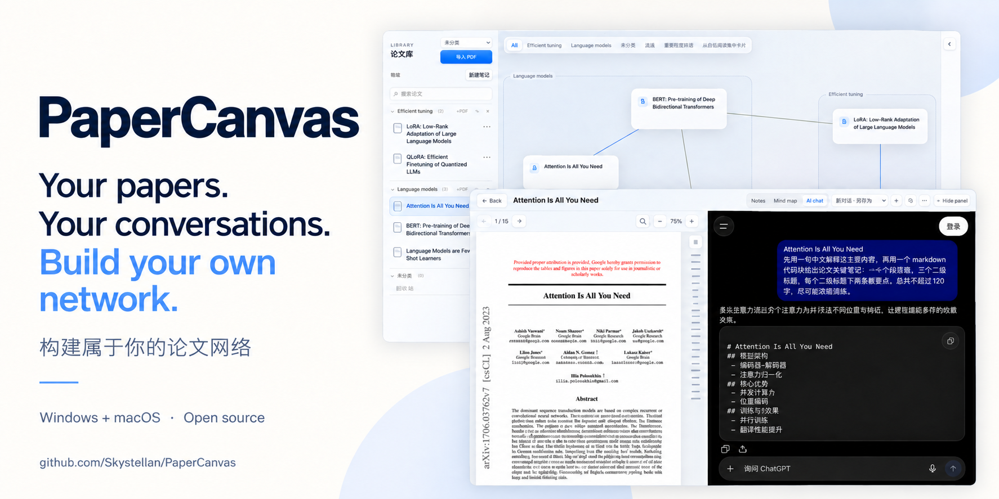

# PaperCanvas



[English](README.md) | **[简体中文](README.zh-CN.md)**

[](LICENSE)

[](https://github.com/Skystellan/PaperCanvas/releases/download/v0.2.8/PaperCanvas-0.2.8-Windows-x64-Setup.exe)
[](https://github.com/Skystellan/PaperCanvas/releases/download/v0.2.8/PaperCanvas-0.2.8-macOS-arm64.zip)
[](https://github.com/Skystellan/PaperCanvas/releases/download/v0.2.8/PaperCanvas-0.2.8-Linux-amd64.deb)

点击上方按钮即可直接下载：**Windows 10/11 x64 安装版**、**macOS 13+ Apple Silicon 版** 或 **Ubuntu 22.04 / 24.04 x64 DEB 安装版**。
[安装教程](#下载安装) · [所有下载与更新说明](https://github.com/Skystellan/PaperCanvas/releases/latest)

**Linux x64：** 参见 [Ubuntu 安装包与安装说明](#linuxubuntu-x64)。

**读论文开了十几个 ChatGPT 标签页？我做了一个把论文和讨论放在一起的开源工具。**

PaperCanvas 把论文库变成一张可视化的思考地图。
将论文放上无限画布，连接彼此的思路，随着理解深入，逐步整理出自己的研究脉络。

**论文与讨论放在一起，不用再为每篇论文在浏览器里开多个聊天窗口或标签页。**
在 PDF 旁边直接向 ChatGPT 提问，由 PaperCanvas 按论文管理聊天：同一篇论文可以保留多条命名讨论，随时切换；再次打开论文时，还能恢复上次的讨论。


[观看高清演示](docs/media/paper-network-demo.mp4) · [查看静态预览](docs/media/paper-network-poster.png) · [查看封面原图](docs/media/papercanvas-cover.png)

- **放入论文。** 从论文库拖动论文到画布。
- **连接思路。** 连起论文之间的关系，记录支持、质疑和证据。
- **整理自己的研究空间。** 移动卡片，连线与领域背景平滑跟随，让研究脉络逐渐清晰。

*演示使用真实公开论文 PDF 和应用内实际打开的 ChatGPT 网页，以 2 倍速播放。思维导图由真实回复中复制的 Markdown 渲染；论文连线仅用于演示，不录制个人论文库或已登录账号。*

在同一个以本地存储为主的工作空间中阅读、高亮、批注和讨论论文。
PDF 与应用数据保存在应用管理的本地目录中。macOS、Windows 和 Linux 桌面版通过 Electron 使用 Chromium；
阅读器可在内嵌浏览器中打开 ChatGPT，批注和基于 Markdown 的 Markmap 思维导图则完全离线运行。

**使用指南：** [下载安装](#下载安装) · [快速上手](#快速上手) ·
[论文库与画布](#论文库与画布) · [账号密码登录](#chatgpt-账号密码登录) ·
[复制论文名与讨论](#复制论文名并开始讨论) · [阅读与批注](#阅读高亮与批注) ·
[笔记](#markdown-笔记) · [思维导图](#思维导图) · [快捷键](#快捷键速查)

**项目信息：** [功能概览](#功能概览) · [本地数据与隐私](#本地数据与内嵌对话) ·
[开发环境](#开发环境要求) · [参与贡献](#参与贡献) · [讨论与建议](https://github.com/Skystellan/PaperCanvas/discussions) · [更新通知](#发布与更新通知) · [许可证](#许可证)

## 下载安装

当前版本为 **0.2.8**。按电脑类型点击下方链接，直接下载安装包，无需在 Release 附件里挑文件。

| 你的电脑 | 下载入口 | 下载后怎么做 |
| --- | --- | --- |
| Windows 10/11，Intel 或 AMD x64 | **[下载 Windows 安装版（.exe）](https://github.com/Skystellan/PaperCanvas/releases/download/v0.2.8/PaperCanvas-0.2.8-Windows-x64-Setup.exe)** | 双击安装，之后支持应用内更新。 |
| macOS 13+，Apple Silicon（M1 或更新芯片） | **[下载 Mac 版（.zip）](https://github.com/Skystellan/PaperCanvas/releases/download/v0.2.8/PaperCanvas-0.2.8-macOS-arm64.zip)** | 解压后将 PaperCanvas.app 移到「应用程序」。 |
| Linux x64，Ubuntu 22.04 / 24.04 | **[下载 Ubuntu 安装版（.deb）](https://github.com/Skystellan/PaperCanvas/releases/download/v0.2.8/PaperCanvas-0.2.8-Linux-amd64.deb)** | [通过 apt 安装](#linuxubuntu-x64)，同时提供 AppImage。 |

[查看更新说明与其他文件](https://github.com/Skystellan/PaperCanvas/releases/latest)。普通安装无需下载源码包或自动更新用的辅助文件。

### Windows

**支持 Windows 10/11，x64（Intel 或 AMD）。**

1. 点击 **[下载 Windows 安装版](https://github.com/Skystellan/PaperCanvas/releases/download/v0.2.8/PaperCanvas-0.2.8-Windows-x64-Setup.exe)**，推荐使用此版本以获得应用内更新。
2. 先退出旧版 PaperCanvas，再运行安装器，通过快捷方式打开应用。它为当前用户安装，并沿用已有的本地数据目录。
3. 使用文件选择器导入 PDF，或从文件资源管理器拖入。PDF 搜索快捷键为 **Ctrl+F**，Markdown 格式快捷键为 **Ctrl+B/I/K**。
4. 以后升级使用 **Help → Check for Updates…（帮助 → 检查更新）**。发现新版后会在后台下载，任务栏显示进度；下载完成后选择 **Restart and install（重启并安装）**，应用会先保存再重启。

**便携版：** 也可以下载 [Windows 便携 ZIP 版](https://github.com/Skystellan/PaperCanvas/releases/download/v0.2.8/PaperCanvas-0.2.8-Windows-x64.zip)，完整解压到可写入的文件夹，打开 `PaperCanvas-win32-x64` 中的 `PaperCanvas.exe`，并保留配套资源和 DLL。ZIP 版仍采用手动更新：先退出应用，再替换程序目录；也可以手动安装一次 Setup 版，之后使用应用内更新。

无需安装 Node.js、Rust 或单独的 WebView2。数据独立保存在 `%APPDATA%\com.papercanvas.desktop`，包括 `chromium` 登录资料目录。同一个 Windows 用户下，安装版与便携版使用同一份数据；请保留你准备使用的程序副本。此社区构建未经发布者签名，首次运行时可能显示未知发布者或 SmartScreen 提示。

### macOS

**支持 Apple Silicon Mac（M1 或更新芯片），macOS 13 及以上。**

1. 点击 **[下载 Mac 版](https://github.com/Skystellan/PaperCanvas/releases/download/v0.2.8/PaperCanvas-0.2.8-macOS-arm64.zip)**。
2. 解压并将 `PaperCanvas.app` 移到 **应用程序** 文件夹。替换旧版本前请先退出应用。
3. 打开 PaperCanvas 并导入 PDF。升级应用会保留本地论文库和笔记。

此社区构建采用临时签名（ad-hoc），没有 Apple Developer ID 签名或公证。
如果 macOS 阻止首次启动，且你信任此次下载，请先尝试打开应用，再前往
**系统设置 → 隐私与安全性 → 仍要打开**。参见 [Apple 官方打开说明](https://support.apple.com/en-us/102445)。
此版本不提供 Intel Mac、原生 Windows ARM64 或 Linux ARM64 二进制包。

### Linux（Ubuntu x64）

首批 Linux 支持目标为 **Ubuntu 22.04 和 24.04，x64（Intel 或 AMD），需要桌面环境**。安装包在 Ubuntu 22.04 构建，CI 也会在 Ubuntu 24.04 安装并测试同一个 `.deb`。其他发行版和 ARM64 暂不在首批验证范围内。

直接下载 **[Ubuntu 安装版（.deb）](https://github.com/Skystellan/PaperCanvas/releases/download/v0.2.8/PaperCanvas-0.2.8-Linux-amd64.deb)** 或 **[Linux AppImage](https://github.com/Skystellan/PaperCanvas/releases/download/v0.2.8/PaperCanvas-0.2.8-Linux-x86_64.AppImage)**。只有从源码构建才需要 Node.js 和 Rust。

**Ubuntu 推荐安装 `.deb`：** 在下载文件所在目录执行，安装后从应用菜单打开 **PaperCanvas**，也可运行 `paper-canvas`：

```sh
sudo apt install ./PaperCanvas-0.2.8-Linux-amd64.deb
```

安装器会配置应用图标，并在 Ubuntu 24.04 配置应用专用的 AppArmor 规则。请使用普通桌面用户运行应用。

**AppImage：** 在兼容的 Linux 桌面环境中，添加执行权限后运行：

```sh
chmod +x PaperCanvas-0.2.8-Linux-x86_64.AppImage
./PaperCanvas-0.2.8-Linux-x86_64.AppImage
```

此 AppImage 使用 FUSE 2（Ubuntu 22.04 可执行 `sudo apt install libfuse2`）。也可用 `APPIMAGE_EXTRACT_AND_RUN=1 ./PaperCanvas-0.2.8-Linux-x86_64.AppImage` 解压运行，避免依赖 FUSE 挂载。如果系统限制 Chromium 的用户命名空间沙箱，Ubuntu 请使用 `.deb`；不要为内嵌聊天添加 `--no-sandbox`。AppImage 不会自动添加应用菜单快捷方式。

Linux 0.2.8 起支持应用内更新：**Help → Check for Updates…（帮助 → 检查更新）** 下载并校验新版，选择 **Restart and install（重启并安装）** 后先保存再安装重启。Ubuntu `.deb` 会弹出系统授权窗口；AppImage 请放在可写入的文件夹中，它会自行更新，无需管理员权限。两种格式共用下表中的数据目录，升级会保留论文库和登录资料。Linux 与 Windows 使用相同的 **Ctrl** 快捷键。

### 手动升级与数据备份

替换程序不会删除论文库，应用文件与个人数据分别保存：

| 平台 | 本地数据目录 |
| --- | --- |
| Windows | `%APPDATA%\com.papercanvas.desktop` |
| macOS | `~/Library/Application Support/com.papercanvas.desktop` |
| Linux | `$XDG_CONFIG_HOME/com.papercanvas.desktop`，默认 `~/.config/com.papercanvas.desktop` |

目录内包含数据库、导入的 PDF、Markdown 笔记，以及用于内嵌登录的 `chromium` 资料目录。ChatGPT 的聊天内容保存在 ChatGPT，PaperCanvas 保存的是讨论链接；保留登录资料不代表 ChatGPT 永远不会要求重新登录。

1. 正常退出 PaperCanvas，等待保存完成。如果出现保存失败提示，先解决错误再升级。
2. 如需备份，在应用关闭后复制**整个数据目录**到安全位置，不要只备份程序或数据库文件。
3. 替换程序或运行新版安装器，再使用同一个系统用户账号打开新版。不要删除数据目录，也不要选择清除个人数据的卸载选项。
4. 打开一篇熟悉的论文，确认笔记正常后再移除旧程序副本，备份另行保留。

Windows 可把上述路径粘贴到文件资源管理器地址栏；Mac 可使用 **Finder → 前往 → 前往文件夹…** 查找。以上是升级步骤；直接用旧版本打开新版数据库并不是受支持的回退方式。

## 快速上手

1. 在左侧「论文库」点击 **导入 PDF**，也可以把 PDF 从 Finder / 文件资源管理器拖入论文库。
2. 将论文库中的论文拖到中间画布，建立一张论文卡片；双击论文库条目或画布卡片进入阅读器。
3. 阅读时使用右侧的 **Notes / Mind map / AI chat**，分别记录笔记、整理导图和打开 ChatGPT。
4. 第一次使用 **AI chat**，点击 **＋** 新建讨论，在内嵌网页中使用原 ChatGPT 账号的邮箱和 OpenAI 密码登录。
5. 点击聊天工具栏的 **⧉（复制论文信息）**，再点击 ChatGPT 输入框，用 **⌘V / Ctrl+V** 粘贴论文名，补上问题并发送。
6. 回到画布，按一次 **空格键**，依次点击两张论文卡片建立连线；按 **Esc** 退出连线模式。

PDF 阅读、批注、笔记和导图可以离线使用；ChatGPT 讨论需要网络和你自己的 ChatGPT 账号。
PaperCanvas 不会自动把正在阅读的 PDF、选中文字或问题发给 ChatGPT。

## 论文库与画布

### 导入、分类与打开论文

- **导入多篇 PDF：** 在「导入 PDF」前选择目标领域，再在文件选择器中选择一个或多个 PDF；也可以从文件管理器拖入。导入的是本地副本，原文件保留。
- **论文标题：** 当前导入标题取自 PDF 文件名，不会自动查询论文元数据。可在导入前把文件改为正式论文名，方便之后搜索与复制；若列表里只是编号，向 ChatGPT 提问时请自行补全标题。
- **领域分类：** 点击「新建领域」输入名称并保存。论文右侧 **⋯ → 移动到领域** 可以调整分类；未分类的论文在「未分区」中。
- **搜索与阅读：** 用「搜索论文」筛选列表。单击条目定位已有的画布卡片，双击条目直接阅读；阅读不要求先把论文拖入画布。
- **调整宽度：** 拖动论文库右侧分隔线；双击该分隔线恢复默认宽度。

### 用空格键给论文连线

1. 先从论文库拖入至少两篇论文，在画布空白处单击，使焦点离开搜索框、按钮或文本编辑区。
2. **按一次空格键**，看到「连线模式：请选择第一个节点」后，松开空格即可；也可以点击画布工具栏的 **连线**。
3. 单击第一张卡片，再单击第二张卡片，建立两篇论文之间的连线。
4. 连好一条后仍处于连线模式，可以继续选择下一对论文。再次按空格会清除当前起点、重新选择第一张卡片。
5. 按 **Esc** 或再次点击 **连线** 按钮退出。退出后才能恢复拖动卡片、双击打开论文。

空格是进入连线模式的快捷键，不需要一直按住，也不用按住空格拖动画布。在搜索框、笔记和其他文本输入区输入空格时，仍按普通文字输入处理。
连线模式下还可以用 **Tab** 把焦点移到卡片，再用 **Enter** 依次选择两个端点。

### 整理画布、解释关系与删除

- 拖动画布空白处可平移视图；滚轮 / 触控板滚动也用于平移，触控板捏合可在 **5%–200%** 之间缩放，缩小后能看到更大范围的论文网络。拖动卡片会带动相关节点和领域背景调整位置。
- 顶部 **All / 领域名 / 未分区** 用来切换显示范围；**重新整理布局** 会重新安排当前范围内的论文。
- 单击一条连线，选择 **Support（支持）/ Challenge（质疑）/ 未分类**。在「解释」中记录关系，在「证据」中填写摘录、来源或页码，点击 **保存解释与证据**。切换选择会保留草稿，进入阅读器前也会保存。
- 选中画布卡片后，按 **Delete / Backspace** 或点击 **从白板移除选中卡片**，只移除卡片及其连线；论文和 PDF 仍在论文库，可以再次拖入。
- 选中连线后，按 **Delete / Backspace** 或点击 **删除选中连线**，只删除关系。
- 论文库中的 **⋯ → 删除 → 确认删除** 会删除论文库记录、受管 PDF 副本及关联内容，原始导入文件不受影响；已有 `.md` 笔记文件会保留作安全副本。只想整理画布时，应使用「从白板移除」。

## ChatGPT 账号密码登录

PaperCanvas 的 **AI chat** 打开的是 ChatGPT 官网。这里使用的是你的 **ChatGPT / OpenAI 账号密码**，不需要另外注册 PaperCanvas 账号或填写 API Key。
应用内的登录状态独立保存；系统浏览器已经登录，不代表应用内也登录了。

### 已有 OpenAI 密码

1. 双击打开一篇论文，选择右侧 **AI chat**；没有讨论时，点击顶部 **＋**。
2. 在内嵌 ChatGPT 页面点击 **Log in / 登录**，输入原账号的完整邮箱，选择密码登录并输入 **OpenAI 密码**。
3. 按页面要求完成邮箱验证或多因素认证。登录后仍可能要求验证码，这本身不代表在注册新账号。
4. 核对 ChatGPT 中的账号、订阅和历史对话，确认与平时使用的账号一致。

登录会话保存在本机的应用数据目录中，通常重新打开应用无需再次登录；会话过期或账号安全策略变化时，需要重新验证。
忘记已设置的 OpenAI 密码，可以在官网登录页面选择 **Forgot password? / 忘记密码**，按邮件完成重置。
密码设置和重置影响同一个 OpenAI 账号。参见 [OpenAI 官方密码说明](https://help.openai.com/en/articles/4936828-resetting-or-changing-your-chatgpt-password)。

### 原来一直用 Google 登录，没有 OpenAI 密码

**Google 密码和 OpenAI 密码是两回事。** 先在已有账号内添加 OpenAI 密码，再尝试应用内的账号密码登录：

1. 在正常使用的系统浏览器打开 [ChatGPT](https://chatgpt.com/)，用 **Continue with Google / 使用 Google 账户继续** 登录原来的 Google 账号。
2. 检查原有 Plus/Pro 订阅和历史对话，在 **Settings → Account / 设置 → 账号** 中确认完整邮箱。
3. 如果该账号提供 **Add password / 添加密码**，在这里完成设置。已经有密码则直接使用；这一步不需要创建新账号，也不需要更改邮箱。
4. 回到 PaperCanvas，在内嵌网页选择 **登录**，使用上一步核对的邮箱和新设的 **OpenAI 密码**，再完成要求的验证。
5. 再次确认订阅和历史对话。若显示错误账号，先在内嵌 ChatGPT 中退出，再按正确账号重试。

社交登录账号添加密码的步骤见 [OpenAI 官方账号说明](https://help.openai.com/en/articles/4936827-how-to-change-your-email-address)。
如果没有「添加密码」入口，或仍提示 **Wrong authentication method**，请继续在系统浏览器用原登录方式访问，或联系 OpenAI 支持；不要把 Google 密码当作 OpenAI 密码，也不要重新注册来尝试“关联”订阅。
未设置 OpenAI 密码的 Google 登录账号，直接使用「忘记密码」并不能代替在原账号内添加密码。

### 登录问题排查

| 现象 | 处理方式 |
| --- | --- |
| 浏览器一打开就已经在聊天页，但应用内仍未登录 | 两边的会话独立。在应用内完成账号密码登录；「在浏览器中打开」只打开网页。 |
| 点击内嵌网页的 Google 登录后出现提示 | 使用上面的账号密码流程；「登录帮助」中也有原 Google 账号添加密码的说明。 |
| 邮箱输入后只看到验证码，或出现姓名、生日等注册资料表单 | 核对是否进入「登录」以及账号邮箱是否正确；仅输入 Gmail 地址不等于完成了 Google 授权。若界面提供密码登录选项，使用已设置的 OpenAI 密码；出现注册流程时先返回核对。 |
| Plus/Pro 和历史对话不见了 | 先检查完整邮箱、登录方式和当前工作区；这不能单独证明新建了账号。不要急于重新订阅，先对照正常浏览器中的原账号。 |
| 空白、加载缓慢或网站验证未完成 | 在聊天的 **⋯** 菜单中选择 **重新加载网页**，或在浏览器中继续。重新加载保留应用内的登录数据。 |

仍无法登录时，参见 [OpenAI 官方登录排查](https://help.openai.com/en/articles/7426629-why-cant-i-log-in-to-chatgpt)。
PaperCanvas 不合并 ChatGPT 账号，不同步外部浏览器 Cookie；「关联已有对话」也只保存链接。

## 复制论文名并开始讨论

### 从当前论文发起讨论

1. 打开论文，切换到 **AI chat**，完成上面的账号密码登录。
2. 点击工具栏的 **＋（新对话）**，为这篇论文建立一条讨论记录。
3. 点击 **⧉（复制论文信息）**。它只把**当前论文标题**放入剪贴板，成功时没有额外弹窗；不会复制 PDF、摘要、作者或全文。
4. 点击 ChatGPT 的消息输入框，按 **⌘V（macOS）/ Ctrl+V（Windows/Linux）**，或使用输入框的粘贴菜单。
5. 检查粘贴的论文名，补充你的问题，手动发送。例如：

   > 我正在阅读《在这里粘贴论文名》。请先确认你能获得的论文信息，帮我梳理研究问题、方法和主要结论；不确定的内容请说明。

**只粘贴标题并不等于 ChatGPT 已经拿到 PDF。** 要分析特定公式、图表或原文，请自行复制相关段落、粘贴截图，或通过 ChatGPT 页面提供的附件入口上传 PDF；能否上传及大小限制由 ChatGPT 决定。
PaperCanvas 不会替你发送这些内容，也不会自动点击发送按钮。

第一条消息产生正式对话后，应用自动保存该对话链接，并按 ChatGPT 网页标题更新讨论名称。
同一篇论文可以有多条讨论：用顶部下拉框切换，用 PaperCanvas 的 **＋** 为新主题创建独立记录。

### 继续已有讨论

1. 如果讨论在浏览器中已有，复制地址栏里的原始对话地址，例如 `https://chatgpt.com/c/…`，不要使用 `/share/…` 分享链接。
2. 在 PaperCanvas 的聊天工具栏点击 **⋯ → 关联已有对话**。
3. 填写「讨论名称」和「ChatGPT 对话链接」，点击 **保存并打开**。应用内登录的账号必须有权访问该对话。

| 聊天工具栏操作 | 用途 |
| --- | --- |
| 顶部下拉框 | 切换当前论文的不同讨论。 |
| **＋** | 新建独立讨论。仅在 ChatGPT 网页内换话题，不会替换已绑定的链接。 |
| **⧉** | 复制当前论文标题，随后需要手动粘贴。 |
| **⋯ → 重命名** | 修改当前讨论的本地名称；之后网页标题变化仍可能同步更新它。 |
| **⋯ → 回到绑定对话** | 网页中走到其他页面后，返回这条记录保存的原对话。 |
| **⋯ → 在浏览器中打开** | 用系统浏览器打开已绑定对话；尚未绑定时打开 ChatGPT 首页。 |
| **⋯ → 登录帮助 / 重新加载网页** | 查看密码登录指引，或重试加载网页。 |

再次打开论文时会恢复上次打开的讨论；首页 **Recent discussions** 可以直接打开相应论文中的指定讨论。
本地保存的是讨论名称与链接，消息内容仍在 ChatGPT 中，无法离线查看。ChatGPT Projects 是可选项，PaperCanvas 自己按论文管理讨论链接。

## 阅读、高亮与批注

- **翻页与缩放：** 在 PDF 区连续滚动，或用顶部 **← / →** 翻页；用 **− / ＋**、触控板捏合或 **⌘ / Ctrl + 滚轮** 调整缩放。再次打开论文会恢复阅读位置和缩放。
- **搜索全文：** 点击放大镜，或在 PDF 阅读区按 **⌘F / Ctrl+F**。输入关键词后，用 **Enter / Shift+Enter** 查找下一个 / 上一个结果，按 **Esc** 关闭搜索。搜索覆盖尚未显示的页面；扫描件需要已有文字层，当前没有 OCR。
- **章节与书签：** PDF 右侧的短线是目录入口，悬停或聚焦后显示标题，也可以点击目录按钮固定展开。点击章节跳转；**收藏本页** 添加书签，再点一次移除。没有内置目录时仍可使用页码导航。
- **保存批注：** 拖选 PDF 文字，弹出 **Annotation** 面板后可填写评论，点击 **Save annotation**。评论可留空，只保存高亮；在批注输入框中也可按 **⌘Enter / Ctrl+Enter** 保存，按 **Esc** 关闭面板。
- **回看高亮：** 在 **Notes** 页签展开 **Highlights**，点击条目回到原文位置；搜索按钮可按摘录、评论或页码筛选。每条高亮也有删除按钮。
- **摘录到笔记：** 在选中文字的面板或已有高亮条目中点击 **Add to notes**，将摘录与来源链接加入当前论文笔记；点击笔记中的来源链接可回到 PDF 对应位置。
- **侧栏布局：** 拖动 PDF 与右侧栏之间的分隔线调整宽度，用顶部 **Hide panel / Show panel** 收起或展开侧栏。

## Markdown 笔记

1. 打开论文的 **Notes** 页签，直接输入笔记。内容自动保存，切换论文、返回画布或退出时会等待待保存内容完成。
2. 默认 **Live preview**：单击某个段落可编辑其 Markdown 源码，移开光标后恢复排版。一整段列表、表格或代码块会一起进入编辑状态。
3. 选中文字后，用工具栏或 **⌘B / Ctrl+B** 加粗、**⌘I / Ctrl+I** 斜体、**⌘K / Ctrl+K** 插入链接；在列表末尾按 **Enter** 继续列表。
4. 通过笔记的 **View** 菜单切换 **Live preview / Source / Read**；可渲染标题、引用、代码块、表格和任务列表。
5. 在笔记操作菜单 **More → Show .md** 中定位绑定的 Markdown 文件；可使用外部编辑器，或把文件所在的 `papers` 目录作为 Obsidian 库打开。

每篇论文绑定一个 `papers/<paper-id>.md` 文件，紧邻受管 PDF；绑定依赖论文 ID，标题变化不会改变绑定。
旧版本数据库中的笔记会在首次打开时迁移到该文件，原数据库记录保留作备份。

外部编辑后，使用 **More → Reload** 读取最新文件；这可能放弃当前未保存草稿，按确认提示操作。
如果保存时提示文件已被外部修改，先复制当前草稿，再 Reload 后合并，避免同时在两个编辑器里写入。
应用在保存前检查外部改动，不会持续监视文件；不包含 Obsidian 插件、双链语法或数学公式渲染。

## 思维导图

1. 在 **AI chat** 中请 ChatGPT 输出 Markdown 大纲，或自己编写。可使用提示：

   > 请把我们讨论的论文整理为 Markdown 大纲：一级标题为论文名，二级标题包含研究问题、方法、实验、结论与局限；细节使用列表，不要输出 Mermaid。

2. 复制大纲，切换到当前论文的 **Mind map** 页签，粘贴到 **Markdown source**。
3. 点击 **Render preview** 渲染。成功后编辑区收起，用 **Edit source** 再次展开；修改源码后需要再次渲染，预览才会更新。
4. 点击节点圆点折叠分支，拖动导图平移，用 **− / ＋** 缩放、**Fit** 适配视图。
5. 点击 **Save source** 主动保存源码；离开或关闭时也会保存未完成草稿。源码和导图均留在本机。

可直接试用下面的格式：

```markdown
# 论文名称
## 研究问题
- 要解决的问题
- 已有方法的不足
## 方法
- 核心思路
- 关键假设
## 实验与结论
- 主要证据
- 局限与后续问题
```

带有 `markdown`、`md` 或 `markmap` 标记的代码围栏也能粘贴；当前使用 **Markmap** 渲染 Markdown，不会自动向 AI 请求生成导图。
旧版树结构会转为 Markdown；已有 Mermaid 文本会保留供复制、修改，需要改写成 Markdown 大纲再渲染。
导图渲染不需要 AI 账号，也不从粘贴内容中加载外部脚本、图片或字体。

## 快捷键速查

`⌘` 表示 macOS 的 Command 键，`Ctrl` 用于 Windows 和 Linux。快捷键取决于当前焦点所在区域。

| 场景 | macOS | Windows / Linux | 效果 |
| --- | --- | --- | --- |
| 画布，焦点不在输入框或按钮上 | 空格 | 空格 | 进入连线模式，随后依次点两张卡片；再次按下会重选起点。 |
| 画布连线模式 | Esc | Esc | 退出连线模式，恢复拖动和双击阅读。 |
| 连线模式中的卡片 | Tab、Enter | Tab、Enter | Tab 移动焦点，Enter 选择端点。 |
| 选中的画布卡片 / 连线 | Delete / Backspace | Delete / Backspace | 从画布移除卡片或删除连线，保留论文库里的论文。 |
| PDF 阅读区 | ⌘F | Ctrl+F | 打开 PDF 全文搜索。 |
| PDF 搜索框 | Enter / Shift+Enter | Enter / Shift+Enter | 下一个 / 上一个匹配。 |
| PDF 搜索框、批注面板 | Esc | Esc | 关闭当前搜索或批注面板。 |
| PDF 上的滚轮操作 | ⌘ + 滚轮 | Ctrl + 滚轮 | 缩放 PDF；也可以直接使用触控板捏合。 |
| 批注输入框 | ⌘Enter | Ctrl+Enter | 保存高亮与可选评论。 |
| Markdown 笔记编辑区 | ⌘B / ⌘I / ⌘K | Ctrl+B / Ctrl+I / Ctrl+K | 加粗 / 斜体 / 插入链接。 |
| ChatGPT 输入框 | ⌘V | Ctrl+V | 粘贴刚刚通过 ⧉ 复制的论文标题或其他剪贴板内容。 |
| 已聚焦的论文库宽度分隔线 | ← / →、Home / End | ← / →、Home / End | 调整宽度，或设为最小 / 最大宽度。 |

如果按空格没有进入连线模式，先退出输入框，在画布空白处单击再试；如果卡片突然不能拖动，检查是否仍在连线模式，按 Esc 退出。
在 ChatGPT 网页内，其他编辑与发送快捷键由 ChatGPT 自己处理。

## 功能概览

- 可调整宽度的论文库，支持搜索、多 PDF 导入、从文件管理器拖入、领域分类和紧凑的论文操作菜单。
- 双击论文库条目即可阅读，单击可定位对应的画布卡片。
- 无限白板，支持领域视图、力导向布局和手动建立连线。
- 从画布移除卡片不会删除论文库中的论文；通过选中后的操作或 Delete / Backspace 删除连线。
- 支持与质疑关系，以及保存在本地的关系解释和证据。
- 基于 PDF.js 的阅读器，支持文字选择、连续滚动、触控板捏合缩放，并恢复每篇论文的阅读位置和阅读器布局。
- 使用 Cmd/Ctrl+F 搜索 PDF 全文，支持结果高亮和前后切换；提供紧凑的右侧目录与本地页码书签。
- 持久保存高亮与评论，为重叠的公式符号提供连贯的高亮背景，并可将带来源链接的摘录加入 Markdown 笔记。
- 自动保存的 Markdown 笔记，支持实时预览、源码与阅读视图、格式快捷键，每篇论文绑定独立的 `.md` 文件。
- 从对话中粘贴 Markdown 大纲或手动编写，即可渲染并保存本地思维导图；无需 AI SDK、运行时或账号。
- 自带 ChatGPT 聊天管理：在可调整宽度的阅读侧栏中，按论文命名、管理和切换多条讨论，关联已有对话，并恢复上次的讨论，省去在浏览器多个聊天标签页中查找的麻烦。
- **Recent discussions（最近讨论）** 默认保持展开。
- 切换页面与关闭应用时协调保存，并以新增 SQLite 迁移的方式升级数据结构。

画布拖动在各领域内部使用持续的力导向布局。连接较多的中心节点具有更大的惯性，因此移动边缘节点时，
整个网络受到的影响较小。拖动中心节点时，与其直接相连且连接较少的邻居会柔和地保持原有相对方向，
既保留星形结构，也允许连线长度变化，以留出间距并避免卡片碰撞。

拖动从现有连线长度开始，不会再次把网络压紧。松手后的卡片会保持落点，周围节点继续调整；
下一次拖动或主动重新布局时，该卡片才可能再次移动。领域背景跟随所属卡片伸缩。
当一个领域扩张到相邻领域时，相邻的整组卡片会平滑让位，同时保留组内排列与领域归属。
跨领域连线保持可见，但不会把两个领域拉近。连线可以相交，布局稳定后才保存位置。
加载时会分开已有的重叠领域，同时保留有效的已保存位置。

连线始终保持直线。网络速度降低后，柔和的排斥力会逐步分开靠近或相交的连线，为卡片周围腾出空间。
弹簧力维持合理间距，也允许适度拉伸以改善可读性。布局逐渐稳定时，过长的连线仍有轻微恢复力，
避免反复拖动不断增大其自然长度。每一帧的移动幅度都有限制；密集网络仍可能存在交叉。
选中或拖动卡片时，所有连线仍完整可见。

## 本地数据与内嵌对话

- `papercanvas.db` 保存在现有的 `com.papercanvas.desktop` 应用数据目录中，与早期 Tauri 版本共用。
- 导入的 PDF 会复制到应用管理的 `papers/<uuid>.pdf` 路径；不会持久保存原始 Finder 路径。
- 论文、布局、连线、批注、笔记和思维导图源码均保存在本地，保存或渲染它们不会联系 AI 服务。
- 内嵌 ChatGPT 的讨论名称和链接保存在本地，消息内容仍在 ChatGPT 中；打开关联讨论时会加载该网站。
- 不会自动发送 PDF、选中文字或问题。「复制论文信息」只复制论文标题，由你决定向 ChatGPT 粘贴什么、附加什么文件。
- 旧版 Codex SDK、运行时桥接、选中文字后的翻译与 AI 提问、自动生成思维导图均已移除。
  历史迁移和旧版存储数据保持完整，以便已有论文库升级时不丢失数据。

## 开发环境要求

- Node.js 22.12 或更新版本，以及 npm。
- 稳定版 Rust，以及开发构建所需的 Tauri 2 前置依赖。
- macOS 13 及以上并安装 Xcode Command Line Tools；或 Windows 10/11 x64，
  安装 Visual Studio 2022 Build Tools（包含“使用 C++ 的桌面开发”与 Windows SDK）。
- Linux：Ubuntu 22.04 / 24.04 x64 桌面环境，并安装以下构建依赖：

```sh
sudo apt update
sudo apt install build-essential pkg-config libwebkit2gtk-4.1-dev \
  libxdo-dev libssl-dev libayatana-appindicator3-dev librsvg2-dev
```

Rust crate 仍包含原 Tauri 桌面壳，因此编译后端需要 GTK/WebKit 开发依赖；Electron 界面本身使用 Chromium。参见 [Tauri 前置要求](https://v2.tauri.app/start/prerequisites/#linux)。

无需安装 Codex 或登录 SDK。内嵌 ChatGPT 仅在用户打开讨论时使用其自身的网站登录。

## 本地运行

```sh
git clone https://github.com/Skystellan/PaperCanvas.git
cd PaperCanvas
npm ci
npm run chromium:dev
```

## 参与贡献

欢迎提交问题报告和聚焦单一改动的 Pull Request。开发配置、项目结构和提交前需要运行的检查，
请参阅 [CONTRIBUTING.md](CONTRIBUTING.md)。

## 许可证

PaperCanvas 使用 [MIT 许可证](LICENSE)。第三方依赖保留各自的许可证。

## 质量检查

```sh
npm run lint
npm run typecheck
npm run test:coverage
npm run build
cargo fmt --manifest-path src-tauri/Cargo.toml --check
cargo clippy --manifest-path src-tauri/Cargo.toml --all-targets --locked -- -D warnings
cargo test --manifest-path src-tauri/Cargo.toml --all-targets --locked
```

为当前平台构建桌面包：

```sh
npm run chromium:build
```

Apple Silicon 平台的产物位于 `release/PaperCanvas-darwin-arm64/PaperCanvas.app`，
Windows x64 的产物位于 `release/PaperCanvas-win32-x64/`。Windows 构建包含
`paper-canvas-backend.exe` 和 ICO 应用图标。安装到固定位置（如 `~/Applications/PaperCanvas.app`）
之前，请先退出正在运行的副本。移动应用不会移动论文数据库或持久保存的 ChatGPT 资料目录。
打包使用经过优化的 Rust release 后端。已发布的 macOS 社区构建采用临时签名；
要获得可验证的发布者身份并改善首次启动体验，需要 Developer ID 签名和公证。

Linux x64 构建会生成 `release/PaperCanvas-linux-x64/`、
`release/PaperCanvas-<version>-Linux-amd64.deb` 和
`release/PaperCanvas-<version>-Linux-x86_64.AppImage`。发布构建使用 Ubuntu 22.04，以兼容所支持的最低 glibc 版本。

**Desktop builds** GitHub Actions 工作流在 macOS、Windows 和 Ubuntu 22.04 上运行，检查前端与 Rust 后端，
执行原生 Electron 冒烟测试，并上传带版本号的产物。Linux 使用 Xvfb 和独立 D-Bus 会话测试安装后的 `.deb` 与 AppImage，再由另一个任务在 Ubuntu 24.04 测试同一个 `.deb`。更新测试使用本地更新源验证错误校验码会阻止安装，再下载并安装两种格式，验证重启和数据保留。自动测试覆盖 X11、PDF 交互和本地聊天测试页；真实 ChatGPT 登录、Wayland 和中文输入法仍需桌面环境验证。也可手动触发该工作流。
工作流成功后，下载各平台的产物，将它们附加到对应版本标签的 GitHub Release，
并使用 `docs/releases/<tag>.md` 中的发布说明。

## 发布与更新通知

**macOS 0.2.6 及以后版本：** 点击 **Help → Check for Updates…（帮助 → 检查更新）**，再在原生更新窗口中点击 **Install Update（安装更新）**。Sparkle 会下载新版、验证更新列表和安装包的签名，并提供 **Install and Relaunch（安装并重新打开）**。PaperCanvas 会经过正常的关闭保存流程再替换程序；论文、笔记和内嵌登录信息保存在独立的数据目录中。之后更新不需要再打开 GitHub、解压文件或拖动应用。

建议把应用放在有写入权限的固定位置，例如 `~/Applications`。安装在受保护目录时，macOS 可能要求授权。下载或签名校验失败时会显示错误，并保留原应用。社区版使用 ad-hoc 应用签名和独立的 Ed25519 更新签名，没有 Apple 公证；首次打开时的 macOS 检查仍然适用。

**从 0.2.5 或更早版本升级：** 需要先退出旧版，手动下载并安装一次 0.2.6 或以后版本，替换旧副本。旧版只有 GitHub 跳转功能，必须经过这一次升级才能获得自动安装能力。

**Linux 0.2.8 及以后版本：** `.deb` 和 AppImage 均支持从 **Help → Check for Updates…** 下载并安装新版，下载完成后校验 SHA512。选择 **Restart and install（重启并安装）** 会先保存；选择 **Later（稍后）** 可继续工作。Ubuntu 通过系统授权窗口调用 apt 安装 `.deb`，取消授权或安装失败会保留当前应用。AppImage 需要对文件及其所在目录有写入权限。

**Windows 0.2.6 及以后版本的 Setup 安装版：** 使用 **Help → Check for Updates…** 下载新的稳定版安装器，并校验 SHA512。任务栏显示进度，完成后选择 **Restart and install（重启并安装）**，即可保存、安装并重新打开；选择 **Later（稍后）** 则继续工作，准备好后再次检查更新。安装失败时会恢复关闭前保存保护。ZIP 便携版仍使用 **View release（查看发布）**，需要手动替换。要从 ZIP 迁移，先退出便携版，再手动安装一次 Setup 版，已有数据会继续使用。旧版 Tauri 应用没有原生更新器。

打包后的 Electron 应用在启动后检查一次 GitHub 最新稳定版。选择 **Later（稍后）** 会关闭提示，应用不会持续轮询。启动检查的超时为 10 秒，失败时不打扰用户；开发和冒烟测试运行不自动检查。更新请求不会发送论文、笔记或登录凭据；原生更新器会连接 GitHub 获取更新列表和安装包，下载耗时取决于网络。

维护者发布时，请使用与应用版本一致的稳定标签 `vX.Y.Z`，创建公开、非草稿、非预发布并标记为 **Latest（最新版本）** 的 Release。正式发布前上传 macOS 和 Windows 便携版 ZIP、Windows **Setup.exe** 及其 **.blockmap**、**latest.yml**、Linux **.deb**、**.AppImage** 及 **latest-linux.yml**、校验文件，以及已签名的 macOS **appcast.xml**。各平台安装包与对应更新列表必须来自同一次构建。macOS 更新器读取最新 Release 中的这个文件，缺少它会导致原生更新检查失败。

macOS 包包含固定版本的官方 [Sparkle](https://sparkle-project.org/) 框架。更新公钥位于 `electron/macos/sparkle.mjs`，对应私钥保存在维护者本机的登录钥匙串中，Sparkle 账号名称为 `PaperCanvas`。准备发布时，将通过 CI 的安装包下载到 `release/`，在保存该密钥的 Mac 上执行：

```sh
node electron/macos/appcast.mjs
```

脚本会使用钥匙串为 macOS ZIP 和更新列表签名，核对安装包签名与应用内公钥是否匹配，并生成 `release/appcast.xml`。将它和签名时使用的原始 ZIP 一起上传；签名后不要再修改 ZIP 或 XML。请安全备份更新密钥；未经迁移直接换密钥会破坏已安装版本的更新信任关系。私钥和钥匙串导出文件都不应提交到 Git。

## Chromium 桌面版与内嵌登录

当前桌面版通过 Electron 的 `WebContentsView` 内嵌 ChatGPT，保留现有 Rust 存储和 Markdown 笔记：

```sh
npm run chromium:dev
npm run chromium:build
```

它沿用 `com.papercanvas.desktop` 数据目录。ChatGPT 使用该目录下 `chromium` 子目录中的独立、
持久化 Chromium 资料，不导入或同步 Chrome 的 Cookie。原 Tauri/WKWebView 版本仍可通过
`npm run tauri -- dev` 运行；对比两个版本时，请先退出另一个版本。

受支持的邮箱密码登录流程（包括已有 Google 账号）见 [ChatGPT 账号密码登录](#chatgpt-账号密码登录)。
外部浏览器登录与内嵌会话独立；应用不会导入浏览器 Cookie。

如果内嵌页面一直空白，使用 **重新加载网页** 可重新加载当前页面，在 Chromium 中会忽略 HTTP 缓存，
但保留登录和会话存储。Chromium 会显示网站验证、网络失败和加载缓慢提示。
重新打开已缓存的视图时，会恢复其加载状态，不会笼统显示“正在打开”。
“请稍候…”等网站验证标题不会覆盖讨论名称。

在两个版本中，**在浏览器中打开** 都会使用默认浏览器及其已有会话打开所选讨论。
当 WKWebView 加载缓慢时，可直接使用此方式继续。切换浏览器引擎可能改善渲染兼容性，
但不保证 ChatGPT 的网络响应更快。

PDF 捏合缩放和连续点击缩放按钮时，先用 CSS transform 预览现有页面层。
输入停止后，PDF.js 应用最终缩放比例，保持指针下的页面位置不变，再以完整分辨率重绘。

`npm run chromium:test` 检查桌面端的边界行为。
`npm run chromium:smoke` 在临时资料目录中运行真实 Chromium 窗口，使用合成的 20 页 PDF 和本地聊天测试页。
它检查缩放、文字选择、聊天草稿保留和远程页面隔离，不访问真实 ChatGPT 对话或用户的论文库。

`PAPERCANVAS_PERFORMANCE=1 node electron/run-smoke.mjs` 使用合成的 150 页 PDF 测量帧耗时，
以及 Chromium 的布局、样式和脚本执行开销。如需改用本地 PDF，可设置
`PAPERCANVAS_SMOKE_PDF=/absolute/path/to/paper.pdf`，将其副本导入临时资料目录。
该模式也会检查缩放稳定后的锚点和文字选择。请先运行 `npm run build` 完成构建。
