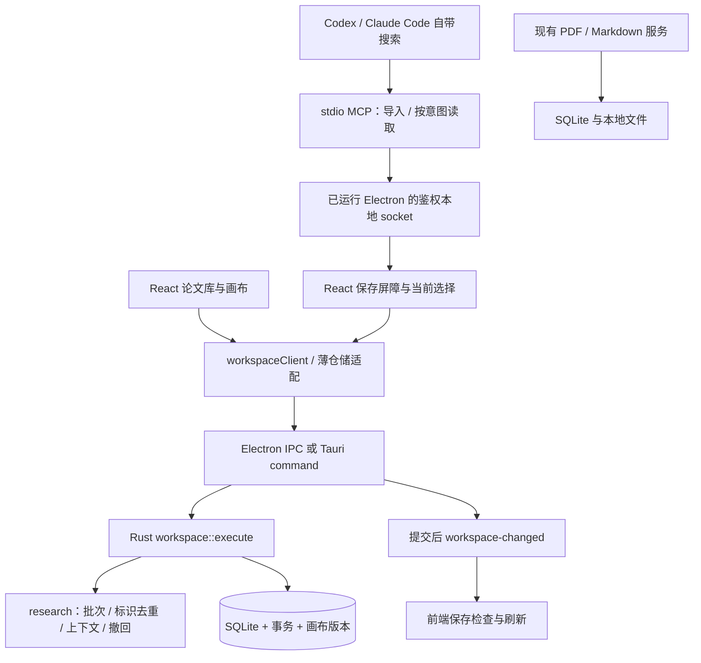

# 工作区架构与扩展边界

当前实现把论文库、领域和画布的持久化规则集中到 Rust 工作区服务。桌面 UI 与论文初筛 MCP 复用同一组业务命令、校验和事务。检索由宿主 AI 自带的工具完成。



## 代码职责

| 位置 | 职责 |
| --- | --- |
| `src/features/` | 展示、交互、选择、草稿和布局计算；仓储适配器调用业务命令 |
| `src/data/workspaceClient.ts` | 类型化请求、桌面调用、冲突错误和变更订阅 |
| `mcp/server.mjs` | 官方 SDK 的 stdio 适配；工具声明、输入结构校验，不访问数据库、不检索 |
| `electron/research-bridge*.mjs` | 每次启动生成令牌和私有连接描述；仅转发两个研究工具 |
| `src/features/research/` | 导入前保存、按实际选择读取、导入记录与撤回、初筛详情、在线阅读入口 |
| `electron/online-pdf.mjs` | 限定 arXiv 的按需获取、请求取消、内存会话、大小与内容指纹检查 |
| `src-tauri/src/online_pdf.rs`、`migrations/0020_paper_pdf_documents.sql` | 查询文档来源、固定内容指纹、向原论文显式附加离线 PDF |
| `electron/backend.mjs`、`src-tauri/src/lib.rs` | 桌面传输和迁移接线；提交成功后通知本地界面 |
| `src-tauri/src/workspace.rs` | 论文查询、标题更新、领域管理、卡片、连线和坐标操作；输入校验、事务及版本检查 |
| `src-tauri/migrations/0018_workspace_revision.sql` | 持久画布版本和触发器，兼顾仍存在的旧 SQL 写入 |
| `src-tauri/src/research.rs`、`migrations/0019_research.sql` | 原子批次导入、稳定标识、初筛元数据、受限上下文、撤回快照 |
| 现有 Rust PDF / Markdown 服务 | PDF 文件导入删除、笔记写入及其现有一致性保护 |

不为了层名建立空接口。当前只有默认画布，服务直接使用现有 SQLite；React 仓储保留原接口，减少对组件的改动。

## 命令协议

桌面入口为 `workspace_command`，参数示例：

```json
{
  "request": {
    "type": "create_edge",
    "sourceNodeId": "node-a",
    "targetNodeId": "node-b"
  },
  "expectedRevision": 12,
  "origin": "caller-session-id"
}
```

返回 `{ "revision": 13, "value": {}, "changed": true }`；`value` 根据操作为快照、记录、列表或 `null`。版本单调增长，但一次操作可能触发多次增长，调用方不能自行计算下一版本。

支持的操作：

- 查询：`load_board`、`list_papers`、`get_paper`、`list_domains`。
- 论文与领域：`update_paper_title`、`create_domain`、`rename_domain`、`delete_domain`、`assign_paper`。
- 画布：`create_paper_node`、`create_edge`、`save_node_positions`、`update_edge_relation`、`update_edge_annotations`、`delete_nodes`、`delete_edges`。
- 研究：`import_research_batch`、`read_research_context`、`list_research_batches`、`undo_research_batch`。后两项仅供本地 UI 使用，不暴露给 MCP。

一个命令在一个事务内完成，包括批量坐标保存、批量删除和级联操作。重复放入同一论文返回现有卡片；重复连接同一对卡片（包括反向）返回现有连线并保留批注。删除卡片保留论文和 PDF；删除领域由外键把其论文归入未分类。历史反向重复连线保留，不通过迁移清理用户数据。

## 并发与刷新

`load_board` 在同一读事务内返回快照和版本。画布仓储按顺序提交写操作，每次携带上次成功读取或写入得到的版本。服务在取得写锁后检查版本，不匹配时返回 `WORKSPACE_CONFLICT`，不执行写入；前端保留草稿，不自动换用新版本重试。重新载入应先处理未保存内容。

`expectedRevision` 是可选的。基于旧快照计算的操作应始终传入；前端画布写操作都传入。领域菜单的独立操作目前不传入，仍采用最新状态上的事务语义，因此版本保护不等于整个论文库的多客户端合并协议。

版本对应默认画布：卡片、连线、画布上论文的元数据以及领域变化会使版本递增。导入未上画布的论文、修改其标题不使版本递增，避免中断无关的布局保存。触发器也覆盖旧 SQL 写入，但旧 SQL 入口本身不产生变更事件。

桌面适配器只在业务命令成功提交且 `changed` 为真时发送 `workspace-changed`，载荷为 `{revision, origin}`。`origin` 用于排除自身更新，不能授权访问。前端收到外部事件后先检查并保存当前草稿，再重载论文库与画布；保存冲突时保留当前界面并提示用户。

Electron 只允许本地阅读器通过 IPC 调用；Tauri 限制为主 webview。研究 MCP 通过运行中的 Electron 完成操作，没有对外 HTTP 端口：macOS/Linux 使用权限为 0600 的 Unix socket，Windows 使用随机命名管道，两者都校验每次启动生成的令牌。连接描述保存在应用资料目录；远程聊天 webview 无权调用本地桥接。独立后端的旧 SQL 写入仍不产生跨进程通知。

## 研究导入与意图边界

| 用户意图 | MCP 行为 | 返回的既有上下文 |
| --- | --- | --- |
| 独立查找某方向 | 宿主先搜索，然后 `import_research_batch` | 无；初始化、工具发现、导入都不读取既有论文正文或笔记 |
| 根据选中论文找相关工作 | 显式 `read_research_context(selected_papers)` | 指定 ID 或真实 UI 选择的书目信息、摘要与内部连线；无选择报错 |
| 在现有图谱找缺口 | 显式 `read_research_context(gap_analysis)` | 指定 ID 或默认画布的最小书目信息、内部连线；不返回摘要 |

上下文最多返回 100 篇，画布超限标记 `truncated`；选中论文摘要最多 4,000 字符并标记 `abstractTruncated`。不返回笔记、文件路径、批注、推荐理由或相邻论文；显式空 ID 列表不能扩大为全图。工具说明要求宿主根据用户意图选择调用；应用不会独立分析聊天内容，也不能替宿主清除其已存在的对话上下文。

上下文连线同时标记 `aiSuggested` 和导入方声明的 `basis`，帮助宿主区分初步建议；用户后来修改的支持/质疑关系优先于初始建议类型。

导入前，界面暂时禁止编辑并等待现有保存完成；保存失败则不提交。Rust 在一个事务中校验整批论文和连线，通过规范化 DOI、arXiv ID、来源 URL 查找已登记的论文，标识冲突整批失败；不按标题推测合并。此前没有来源标识的本地 PDF 不会被自动认作同一篇。

新论文可只有元数据，保留来源、推荐理由、分组和摘要；不自动下载 PDF。新卡片按分组排列在现有画布右侧，旧卡片位置不变。分组是初筛标签，不自动创建用户领域。建议连线保留类型、解释、证据及阅读依据（默认仅元数据）；已有连线与批注不覆盖。

`requestId` 和完整输入共同定义可重试批次：相同请求返回原结果，不重复插入；复用 ID 但修改输入会报错。响应只返回批次 ID、计数与新旧 ID 映射，不返回既有论文内容。数据库已提交但界面刷新失败时，返回已保存结果及提示，避免把成功写入误报为失败。

“AI 导入”面板显示最近 20 批。撤回比较该批新增卡片、连线及论文元数据的快照；已有修改、对象删除或额外连接时整批停止撤回。成功时只删除本批新增的卡片、连线，保留论文、PDF 和阅读笔记；重复撤回无副作用，已撤回请求不能原样重放。

## 当前范围

本轮提供本地 stdio MCP 与 Electron 连接，见 [连接说明](../mcp/README.md)。Tauri 可复用原生研究命令，但尚未接入本地 MCP 或在线 PDF 传输。内嵌 ChatGPT 网页不会因新增 MCP 自动获得这些工具；本轮也不提供远程 HTTP 接入、应用内自动调度模型或自动匹配既有本地 PDF。

阅读器标注、思维导图、对话记录仍使用现有仓储；PDF/笔记仍使用原有原生命令。大型 React 组件尚未全面拆分。

## 在线阅读与离线保存

研究导入只存书目信息。用户打开 arXiv 候选论文时，`ResearchPdfReader` 通过受信 IPC 创建
一个内存文档会话，Electron 查询 Rust 的论文来源后按需获取 PDF，再把字节传给原有
`PdfViewer`。PDF.js 继续负责目录、搜索、缩放和标注，不增加另一套阅读器。

请求通过独立的非持久 Electron session 发出，禁用磁盘缓存且不携带凭据。URL 与每次
重定向只允许 HTTPS arXiv PDF、同一论文及已指定版本，最多三次跳转、60 秒、50 MiB；
检查响应大小与 PDF 签名。本版完整读取到内存，不实现 Range 分块缓存。只有一个活动会话，
关闭论文、替换请求或重载界面会取消请求并释放引用；切到初筛信息后返回则复用同一次加载。

Rust 单独记录首个文档的来源与 SHA256，不更改研究导入元数据或画布版本。后续在线内容
不一致时拒绝交付给阅读器，保护按页坐标保存的旧批注。来源的显式 arXiv 版本会保留；
未指定版本且服务没有跳转到具体版本时，以内容指纹阻止静默更换，暂不提供版本迁移。

只有点击 **保存离线** 后，前端先保存草稿，Electron 才把当前会话字节暂存到私有临时目录，
让 Rust 校验指纹并附加到原论文的 `papers/<paper-id>.pdf`，结束后清理暂存文件。
文件发布、数据库提交和失败补偿复用原 PDF 导入服务。重复保存幂等，不覆盖其他文件，
不创建第二篇论文。笔记、批注和阅读进度仍以论文 ID 关联，书签沿用最终受管路径作为键。
保存完成后刷新论文库与画布；保存中的操作纳入现有持久化屏障。

本地 PDF 优先打开，支持断网阅读。其他来源仍展示初筛信息与来源链接。MCP 只导入元数据
及按意图读取受限上下文，不能发起在线文档请求、写入任意 URL 或指定离线文件路径。

## 验证位置

- Rust 工作区测试覆盖真实 SQLite 事务、旧版本拒写、领域规则、连线幂等性和迁移保留。
- 前端仓储测试覆盖请求映射、写入队列和冲突后不自动重试；App 测试覆盖外部刷新前的保存屏障及草稿保留。
- `electron/workspace-smoke.mjs` 使用真实后端和隔离桌面资料目录，验证外部命令刷新界面与冲突拒写，并继续运行原有画布、阅读器流程。
- `mcp/server.test.mjs` 使用官方 SDK 客户端验证协议、意图边界、输入校验和独立打包入口；`electron/research-bridge.test.mjs` 验证鉴权、调用范围及进程生命周期。
- `electron/research-smoke.mjs` 使用真正的 MCP 子进程、Electron 和 Rust，检查独立导入、幂等重试、选择范围、初筛详情、布局保持和 UI 撤回。使用合成元数据，不调用真实搜索或账号。
- `electron/online-pdf.test.mjs` 覆盖重定向、大小/时限、取消及会话隔离；`src-tauri/tests/online_pdf.rs` 覆盖指纹固定、原论文附加、幂等、文件不覆盖和失败恢复。
- `electron/online-pdf-smoke.mjs` 使用合成网络响应和真实阅读器，检查不落盘预览、信息切换、版本变化拒绝、显式保存、保留笔记/批注/书签及断网重开。
